# Activity Diagrams

## Overview

This document contains detailed activity diagrams for all critical business workflows in the Maheshwari Motors inventory and billing management system.

---

## 1. User Onboarding Flow

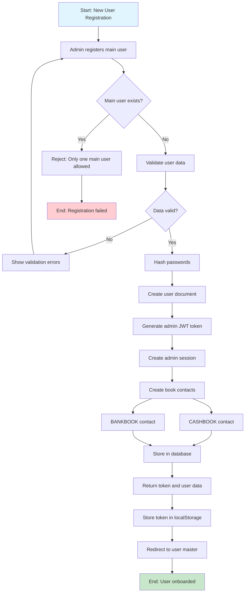

---

## 2. Firm Setup Workflow

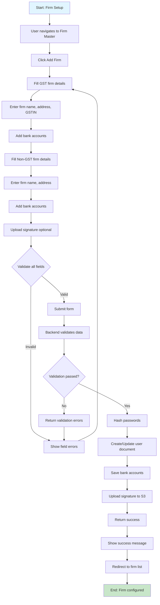

---

## 3. Item Creation and Management

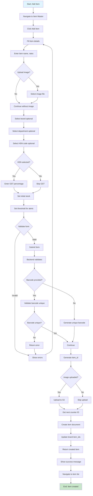

---

## 4. Challan Creation Workflow

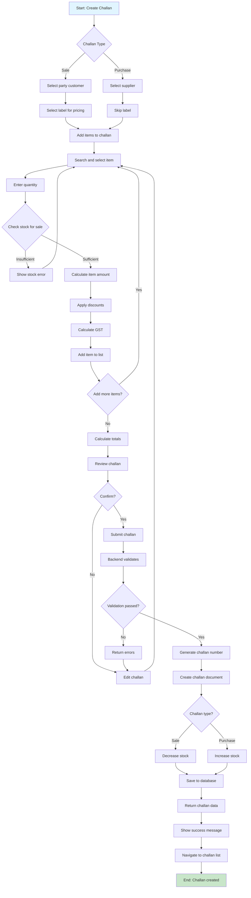

---

## 5. Bill Generation from Challans

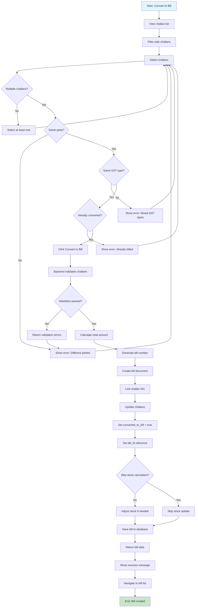

---

## 6. Payment Recording Workflow

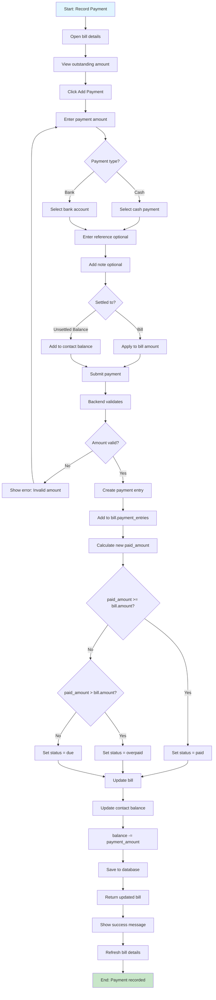

---

## 7. Stock Alert Monitoring

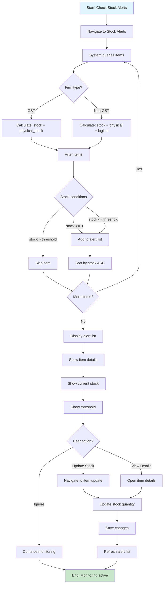

---

## 8. Auto Bill Generation (Automation)

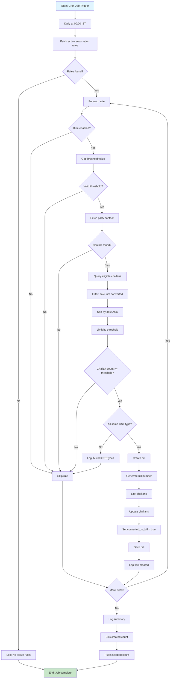

---

## 9. Subscription Expiry Check

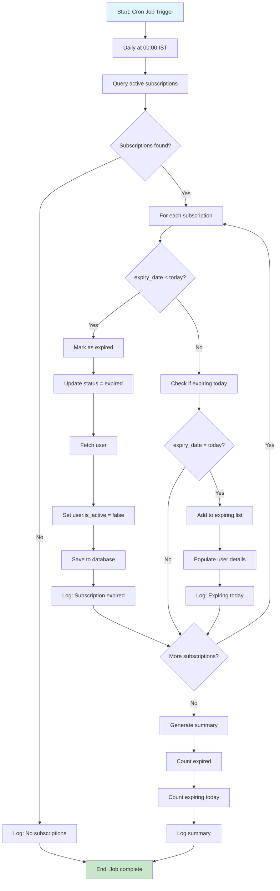

---

## 10. Report Generation Workflow

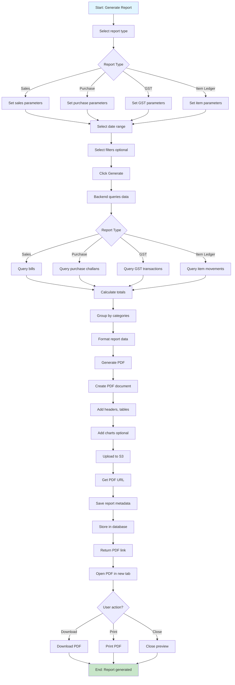

---

## 11. Return Processing Workflow

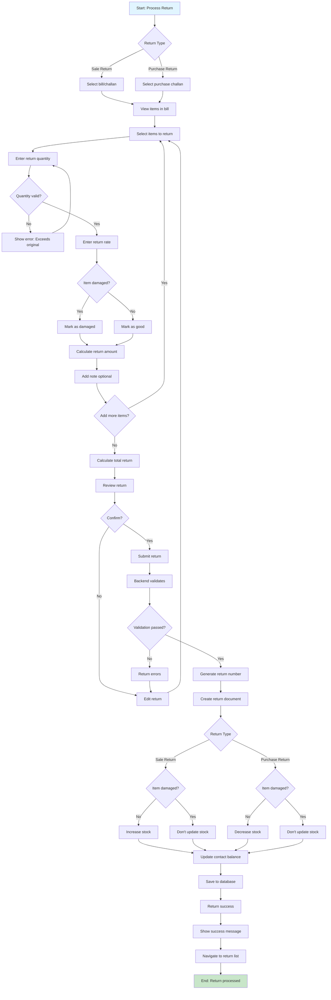

---

## 12. Transaction Recording Workflow

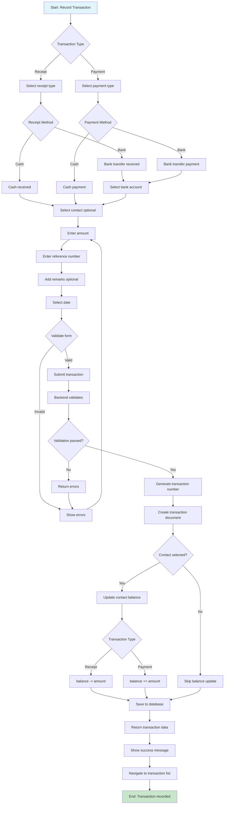

---

## 13. Batch Item Update Workflow

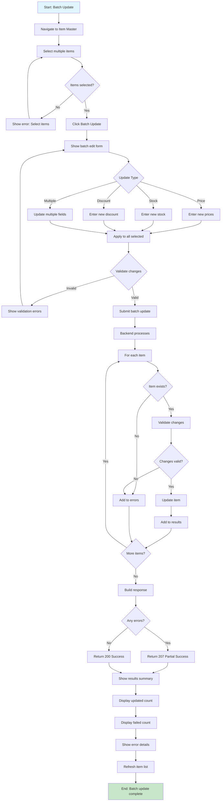

---

## 14. Outstanding Calculation Workflow

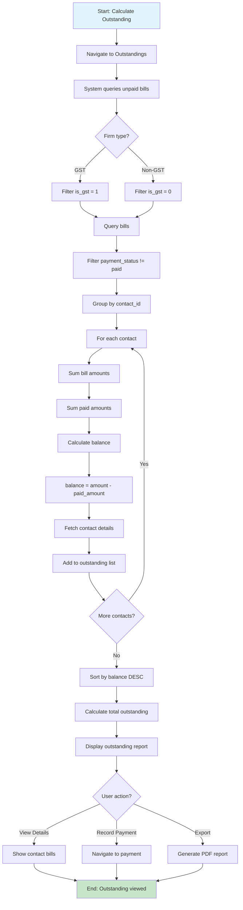

---

## 15. Firm Context Switching

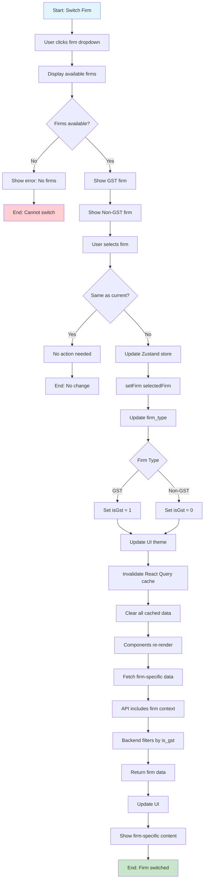

---

## 16. Session Expiry Handling

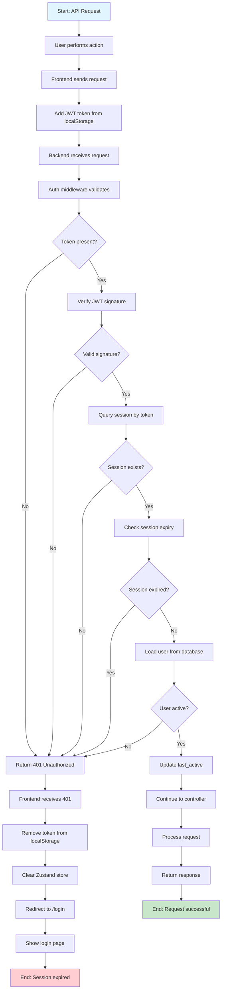

---

## 17. Data Backup Workflow

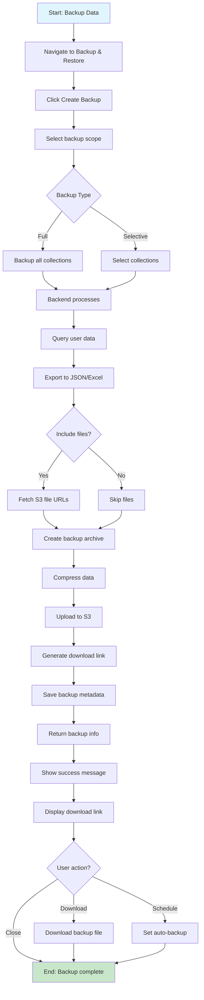

---

## 18. Error Recovery Workflow

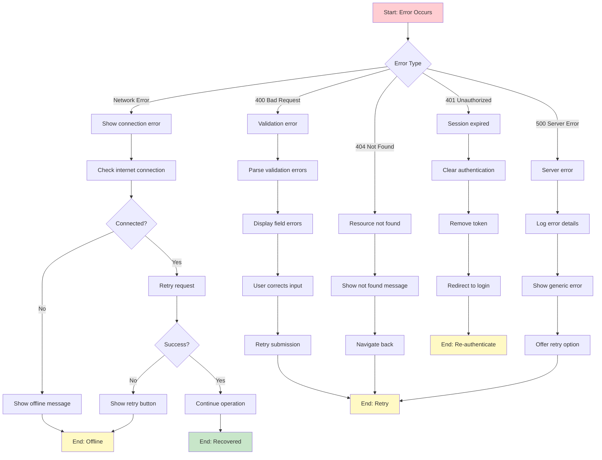

---

## Summary

These activity diagrams illustrate:

✅ **User onboarding** - Registration and firm setup
✅ **Core business workflows** - Item, challan, bill, payment processing
✅ **Automation logic** - Auto-billing and subscription checks
✅ **Stock management** - Alerts and updates
✅ **Reporting** - Report generation and export
✅ **Transaction processing** - Returns and transactions
✅ **Batch operations** - Bulk item updates
✅ **Outstanding management** - Balance calculations
✅ **Firm switching** - Context changes
✅ **Session management** - Expiry handling
✅ **Data backup** - Backup and restore
✅ **Error recovery** - Comprehensive error handling

All workflows demonstrate complete business processes from start to finish with decision points, validations, and error handling.
