# Data Flow Diagram

## Overview

This document illustrates the complete data flow in the Maheshwari Motors application, from frontend user interactions to backend database operations and back.

---

## 1. Complete System Data Flow

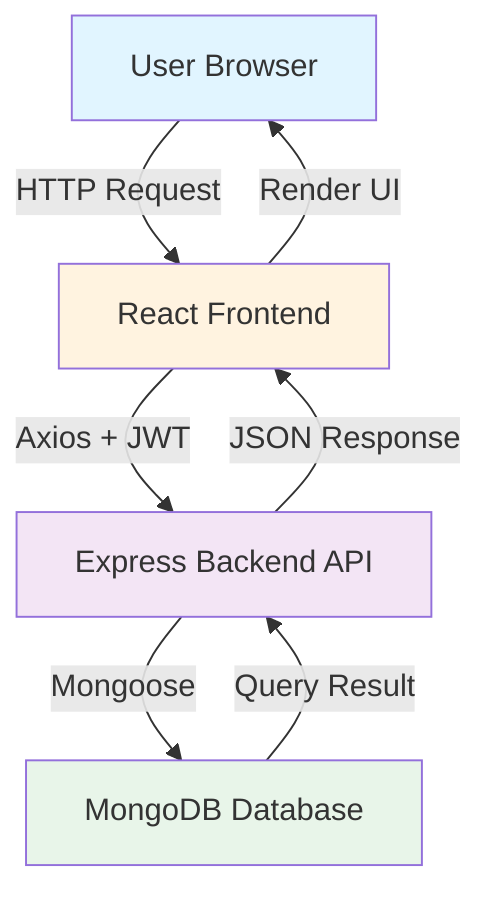
```mermaid
flowchart TD
    A[User Browser] -->|HTTP Request| B[React Frontend]
    B -->|Axios + JWT| C[Express Backend API]
    C -->|Mongoose| D[MongoDB Database]
    D -->|Query Result| C
    C -->|JSON Response| B
    B -->|Render UI| A
    
    style A fill:#e1f5ff
    style B fill:#fff3e0
    style C fill:#f3e5f5
    style D fill:#e8f5e9
```

---

## 2. Authentication Flow

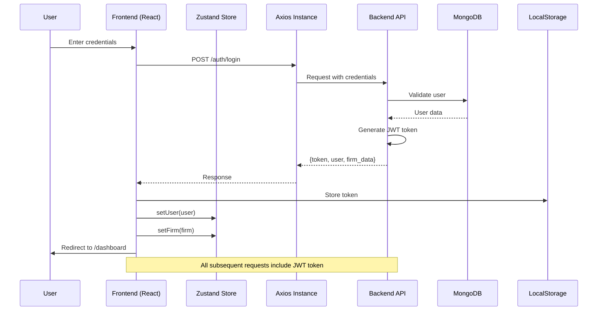
```mermaid
sequenceDiagram
    participant U as User
    participant F as Frontend (React)
    participant S as Zustand Store
    participant A as Axios Instance
    participant B as Backend API
    participant DB as MongoDB
    participant LS as LocalStorage

    U->>F: Enter credentials
    F->>A: POST /auth/login
    A->>B: Request with credentials
    B->>DB: Validate user
    DB-->>B: User data
    B->>B: Generate JWT token
    B-->>A: {token, user, firm_data}
    A-->>F: Response
    F->>LS: Store token
    F->>S: setUser(user)
    F->>S: setFirm(firm)
    F->>U: Redirect to /dashboard
    
    Note over F,B: All subsequent requests include JWT token
```

---

## 3. Data Fetching Flow (React Query)

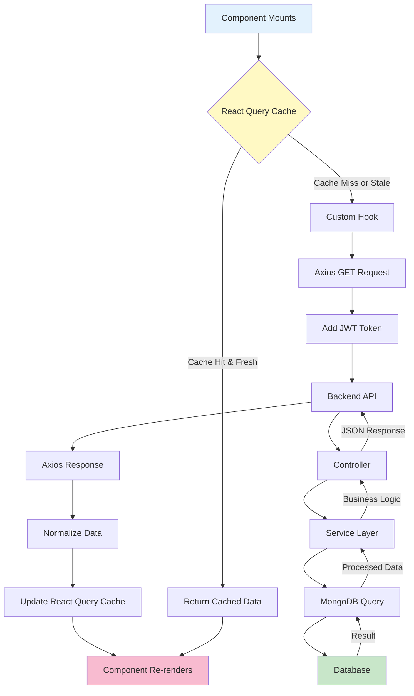
```mermaid
flowchart TD
    A[Component Mounts] --> B{React Query Cache}
    B -->|Cache Hit & Fresh| C[Return Cached Data]
    B -->|Cache Miss or Stale| D[Custom Hook]
    D --> E[Axios GET Request]
    E --> F[Add JWT Token]
    F --> G[Backend API]
    G --> H[Controller]
    H --> I[Service Layer]
    I --> J[MongoDB Query]
    J --> K[Database]
    K -->|Result| J
    J -->|Processed Data| I
    I -->|Business Logic| H
    H -->|JSON Response| G
    G --> L[Axios Response]
    L --> M[Normalize Data]
    M --> N[Update React Query Cache]
    N --> O[Component Re-renders]
    C --> O
    
    style A fill:#e3f2fd
    style B fill:#fff9c4
    style K fill:#c8e6c9
    style O fill:#f8bbd0
```

---

## 4. Item Creation Flow

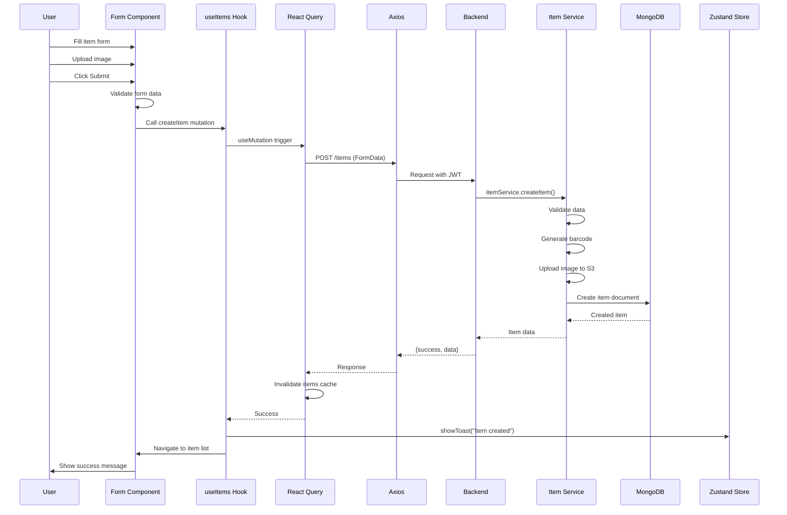
```mermaid
sequenceDiagram
    participant U as User
    participant F as Form Component
    participant H as useItems Hook
    participant RQ as React Query
    participant A as Axios
    participant BE as Backend
    participant S as Item Service
    participant DB as MongoDB
    participant Z as Zustand Store

    U->>F: Fill item form
    U->>F: Upload image
    U->>F: Click Submit
    F->>F: Validate form data
    F->>H: Call createItem mutation
    H->>RQ: useMutation trigger
    RQ->>A: POST /items (FormData)
    A->>BE: Request with JWT
    BE->>S: itemService.createItem()
    S->>S: Validate data
    S->>S: Generate barcode
    S->>S: Upload image to S3
    S->>DB: Create item document
    DB-->>S: Created item
    S-->>BE: Item data
    BE-->>A: {success, data}
    A-->>RQ: Response
    RQ->>RQ: Invalidate items cache
    RQ-->>H: Success
    H->>Z: showToast("Item created")
    H->>F: Navigate to item list
    F->>U: Show success message
```

---

## 5. Challan to Bill Conversion Flow

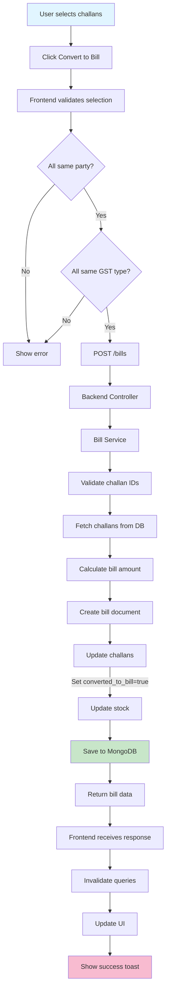
```mermaid
flowchart TD
    A[User selects challans] --> B[Click Convert to Bill]
    B --> C[Frontend validates selection]
    C --> D{All same party?}
    D -->|No| E[Show error]
    D -->|Yes| F{All same GST type?}
    F -->|No| E
    F -->|Yes| G[POST /bills]
    G --> H[Backend Controller]
    H --> I[Bill Service]
    I --> J[Validate challan IDs]
    J --> K[Fetch challans from DB]
    K --> L[Calculate bill amount]
    L --> M[Create bill document]
    M --> N[Update challans]
    N -->|Set converted_to_bill=true| O[Update stock]
    O --> P[Save to MongoDB]
    P --> Q[Return bill data]
    Q --> R[Frontend receives response]
    R --> S[Invalidate queries]
    S --> T[Update UI]
    T --> U[Show success toast]
    
    style A fill:#e1f5ff
    style P fill:#c8e6c9
    style U fill:#f8bbd0
```

---

## 6. Stock Update Flow

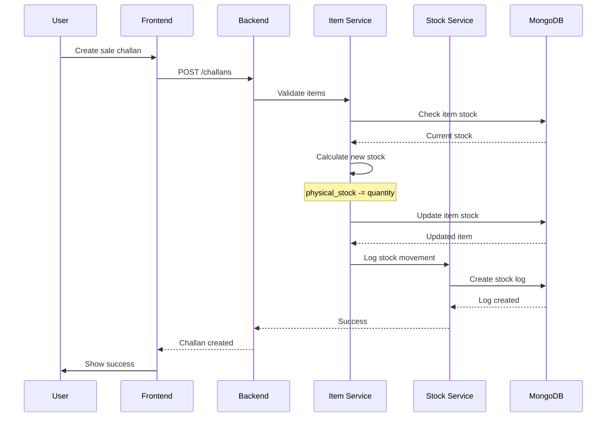
```mermaid
sequenceDiagram
    participant U as User
    participant F as Frontend
    participant BE as Backend
    participant IS as Item Service
    participant SS as Stock Service
    participant DB as MongoDB

    U->>F: Create sale challan
    F->>BE: POST /challans
    BE->>IS: Validate items
    IS->>DB: Check item stock
    DB-->>IS: Current stock
    IS->>IS: Calculate new stock
    Note over IS: physical_stock -= quantity
    IS->>DB: Update item stock
    DB-->>IS: Updated item
    IS->>SS: Log stock movement
    SS->>DB: Create stock log
    DB-->>SS: Log created
    SS-->>BE: Success
    BE-->>F: Challan created
    F->>U: Show success
```

---

## 7. Dashboard Data Aggregation

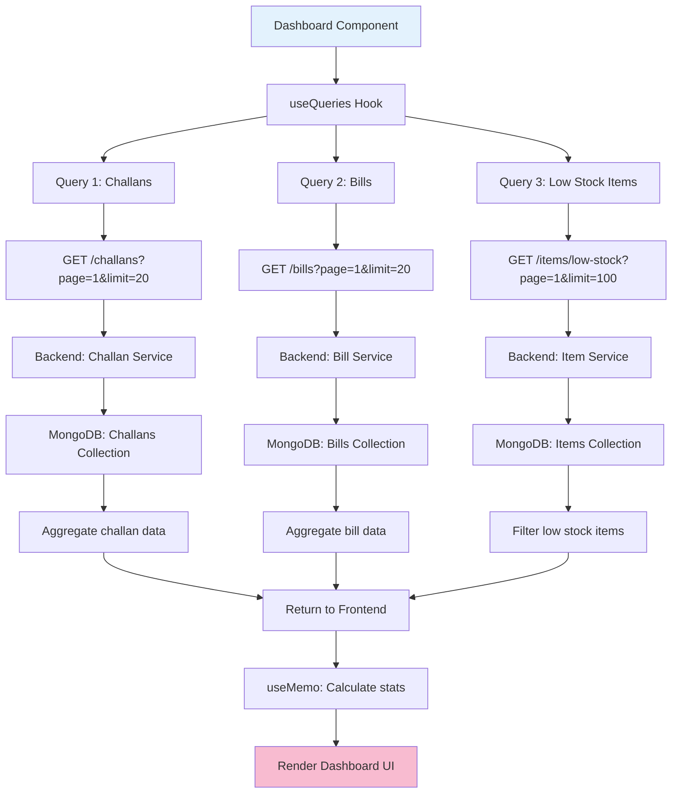
```mermaid
flowchart TD
    A[Dashboard Component] --> B[useQueries Hook]
    B --> C[Query 1: Challans]
    B --> D[Query 2: Bills]
    B --> E[Query 3: Low Stock Items]
    
    C --> F[GET /challans?page=1&limit=20]
    D --> G[GET /bills?page=1&limit=20]
    E --> H[GET /items/low-stock?page=1&limit=100]
    
    F --> I[Backend: Challan Service]
    G --> J[Backend: Bill Service]
    H --> K[Backend: Item Service]
    
    I --> L[MongoDB: Challans Collection]
    J --> M[MongoDB: Bills Collection]
    K --> N[MongoDB: Items Collection]
    
    L --> O[Aggregate challan data]
    M --> P[Aggregate bill data]
    N --> Q[Filter low stock items]
    
    O --> R[Return to Frontend]
    P --> R
    Q --> R
    
    R --> S[useMemo: Calculate stats]
    S --> T[Render Dashboard UI]
    
    style A fill:#e3f2fd
    style T fill:#f8bbd0
```

---

## 8. Report Generation Flow

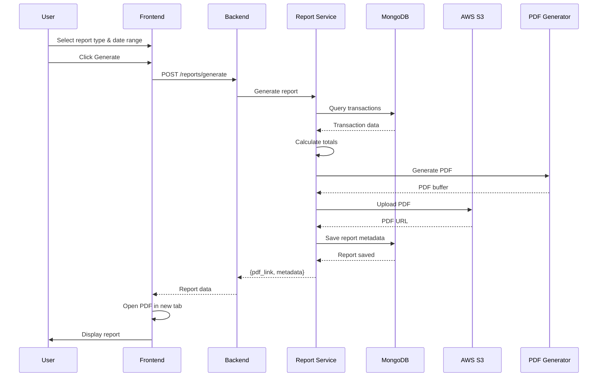
```mermaid
sequenceDiagram
    participant U as User
    participant F as Frontend
    participant BE as Backend
    participant RS as Report Service
    participant DB as MongoDB
    participant S3 as AWS S3
    participant PDF as PDF Generator

    U->>F: Select report type & date range
    U->>F: Click Generate
    F->>BE: POST /reports/generate
    BE->>RS: Generate report
    RS->>DB: Query transactions
    DB-->>RS: Transaction data
    RS->>RS: Calculate totals
    RS->>PDF: Generate PDF
    PDF-->>RS: PDF buffer
    RS->>S3: Upload PDF
    S3-->>RS: PDF URL
    RS->>DB: Save report metadata
    DB-->>RS: Report saved
    RS-->>BE: {pdf_link, metadata}
    BE-->>F: Report data
    F->>F: Open PDF in new tab
    F->>U: Display report
```

---

## 9. Multi-Tenancy Data Isolation

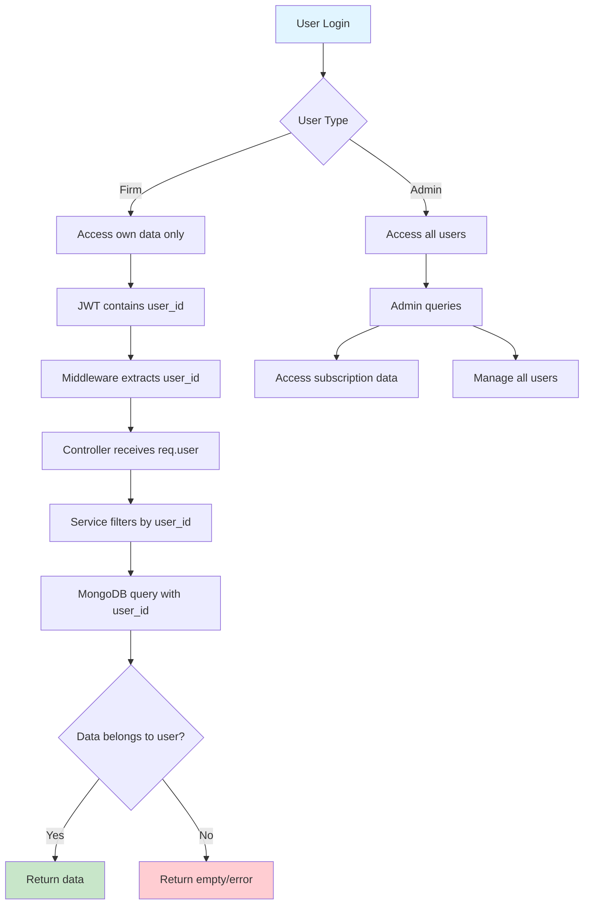
```mermaid
flowchart TD
    A[User Login] --> B{User Type}
    B -->|Admin| C[Access all users]
    B -->|Firm| D[Access own data only]
    
    D --> E[JWT contains user_id]
    E --> F[Middleware extracts user_id]
    F --> G[Controller receives req.user]
    G --> H[Service filters by user_id]
    H --> I[MongoDB query with user_id]
    I --> J{Data belongs to user?}
    J -->|Yes| K[Return data]
    J -->|No| L[Return empty/error]
    
    C --> M[Admin queries]
    M --> N[Access subscription data]
    M --> O[Manage all users]
    
    style A fill:#e1f5ff
    style K fill:#c8e6c9
    style L fill:#ffcdd2
```

---

## 10. Firm Context Flow (GST/Non-GST)

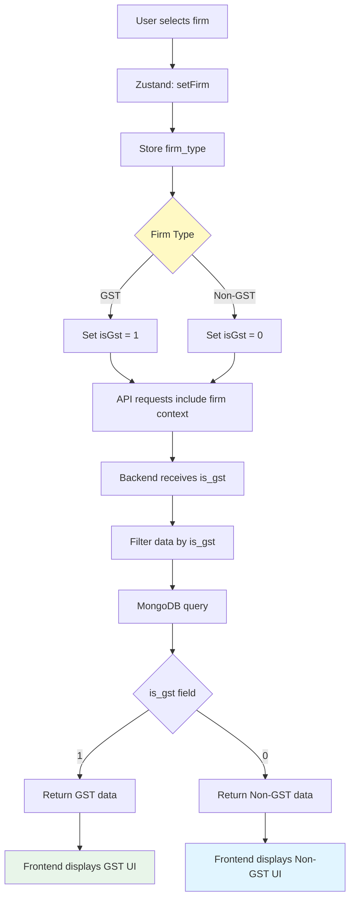
```mermaid
flowchart TD
    A[User selects firm] --> B[Zustand: setFirm]
    B --> C[Store firm_type]
    C --> D{Firm Type}
    D -->|GST| E[Set isGst = 1]
    D -->|Non-GST| F[Set isGst = 0]
    
    E --> G[API requests include firm context]
    F --> G
    
    G --> H[Backend receives is_gst]
    H --> I[Filter data by is_gst]
    I --> J[MongoDB query]
    J --> K{is_gst field}
    K -->|1| L[Return GST data]
    K -->|0| M[Return Non-GST data]
    
    L --> N[Frontend displays GST UI]
    M --> O[Frontend displays Non-GST UI]
    
    style D fill:#fff9c4
    style N fill:#e8f5e9
    style O fill:#e1f5ff
```

---

## 11. Real-time Stock Calculation

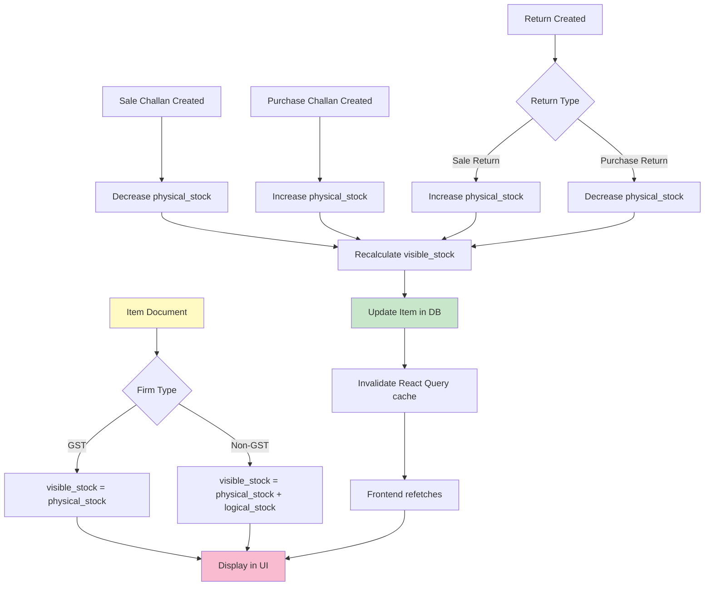
```mermaid
flowchart TD
    A[Item Document] --> B{Firm Type}
    B -->|GST| C[visible_stock = physical_stock]
    B -->|Non-GST| D[visible_stock = physical_stock + logical_stock]
    
    C --> E[Display in UI]
    D --> E
    
    F[Sale Challan Created] --> G[Decrease physical_stock]
    H[Purchase Challan Created] --> I[Increase physical_stock]
    J[Return Created] --> K{Return Type}
    K -->|Sale Return| L[Increase physical_stock]
    K -->|Purchase Return| M[Decrease physical_stock]
    
    G --> N[Recalculate visible_stock]
    I --> N
    L --> N
    M --> N
    
    N --> O[Update Item in DB]
    O --> P[Invalidate React Query cache]
    P --> Q[Frontend refetches]
    Q --> E
    
    style A fill:#fff9c4
    style O fill:#c8e6c9
    style E fill:#f8bbd0
```

---

## 12. Payment Tracking Flow

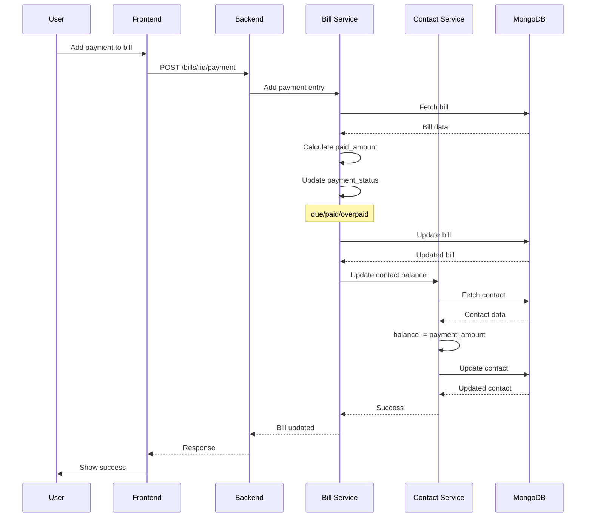
```mermaid
sequenceDiagram
    participant U as User
    participant F as Frontend
    participant BE as Backend
    participant BS as Bill Service
    participant CS as Contact Service
    participant DB as MongoDB

    U->>F: Add payment to bill
    F->>BE: POST /bills/:id/payment
    BE->>BS: Add payment entry
    BS->>DB: Fetch bill
    DB-->>BS: Bill data
    BS->>BS: Calculate paid_amount
    BS->>BS: Update payment_status
    Note over BS: due/paid/overpaid
    BS->>DB: Update bill
    DB-->>BS: Updated bill
    BS->>CS: Update contact balance
    CS->>DB: Fetch contact
    DB-->>CS: Contact data
    CS->>CS: balance -= payment_amount
    CS->>DB: Update contact
    DB-->>CS: Updated contact
    CS-->>BS: Success
    BS-->>BE: Bill updated
    BE-->>F: Response
    F->>U: Show success
```

---

## 13. Cron Job Flow (Auto Bill Generation)

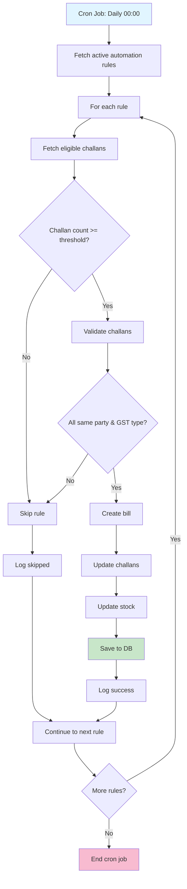
```mermaid
flowchart TD
    A[Cron Job: Daily 00:00] --> B[Fetch active automation rules]
    B --> C[For each rule]
    C --> D[Fetch eligible challans]
    D --> E{Challan count >= threshold?}
    E -->|No| F[Skip rule]
    E -->|Yes| G[Validate challans]
    G --> H{All same party & GST type?}
    H -->|No| F
    H -->|Yes| I[Create bill]
    I --> J[Update challans]
    J --> K[Update stock]
    K --> L[Save to DB]
    L --> M[Log success]
    F --> N[Log skipped]
    M --> O[Continue to next rule]
    N --> O
    O --> P{More rules?}
    P -->|Yes| C
    P -->|No| Q[End cron job]
    
    style A fill:#e1f5ff
    style L fill:#c8e6c9
    style Q fill:#f8bbd0
```

---

## 14. Error Handling Flow

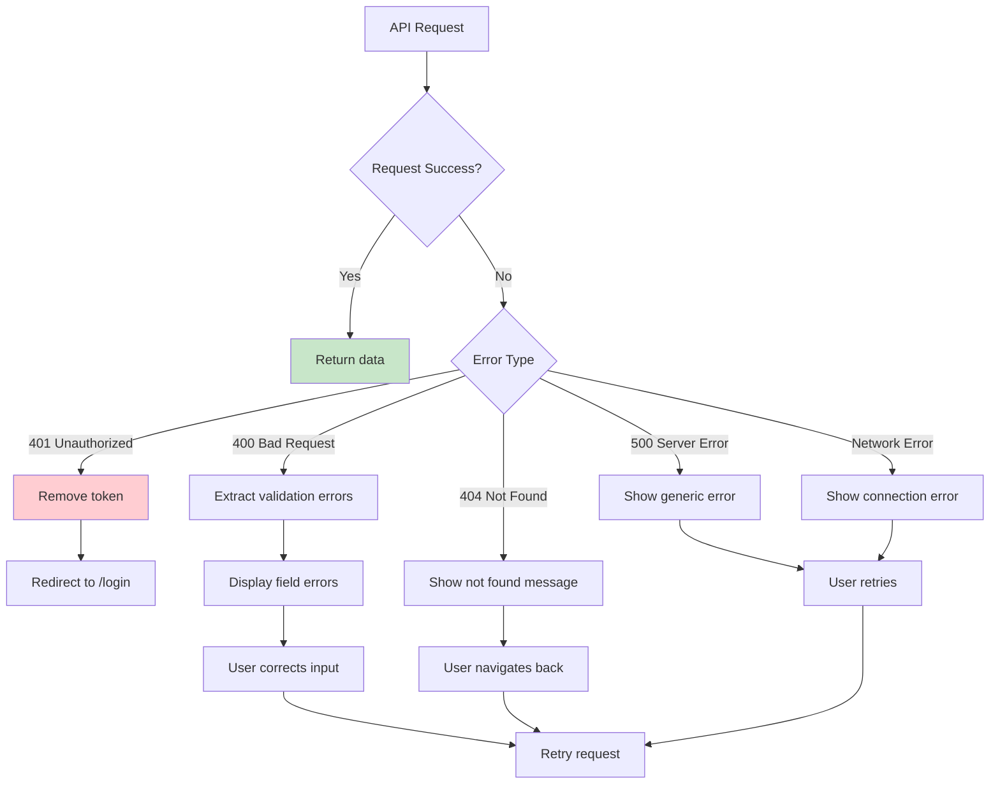
```mermaid
flowchart TD
    A[API Request] --> B{Request Success?}
    B -->|Yes| C[Return data]
    B -->|No| D{Error Type}
    
    D -->|401 Unauthorized| E[Remove token]
    E --> F[Redirect to /login]
    
    D -->|400 Bad Request| G[Extract validation errors]
    G --> H[Display field errors]
    
    D -->|404 Not Found| I[Show not found message]
    
    D -->|500 Server Error| J[Show generic error]
    
    D -->|Network Error| K[Show connection error]
    
    H --> L[User corrects input]
    I --> M[User navigates back]
    J --> N[User retries]
    K --> N
    
    L --> O[Retry request]
    M --> O
    N --> O
    
    style E fill:#ffcdd2
    style C fill:#c8e6c9
```

---

## 15. Component State Management

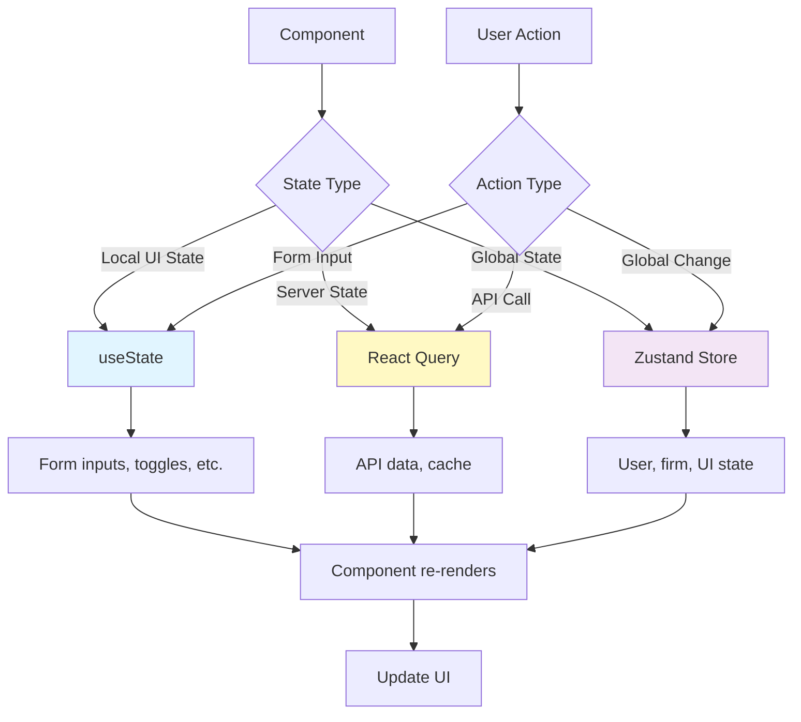
```mermaid
flowchart TD
    A[Component] --> B{State Type}
    
    B -->|Local UI State| C[useState]
    C --> D[Form inputs, toggles, etc.]
    
    B -->|Server State| E[React Query]
    E --> F[API data, cache]
    
    B -->|Global State| G[Zustand Store]
    G --> H[User, firm, UI state]
    
    D --> I[Component re-renders]
    F --> I
    H --> I
    
    I --> J[Update UI]
    
    K[User Action] --> L{Action Type}
    L -->|Form Input| C
    L -->|API Call| E
    L -->|Global Change| G
    
    style C fill:#e1f5ff
    style E fill:#fff9c4
    style G fill:#f3e5f5
```

---

## 16. File Upload Flow

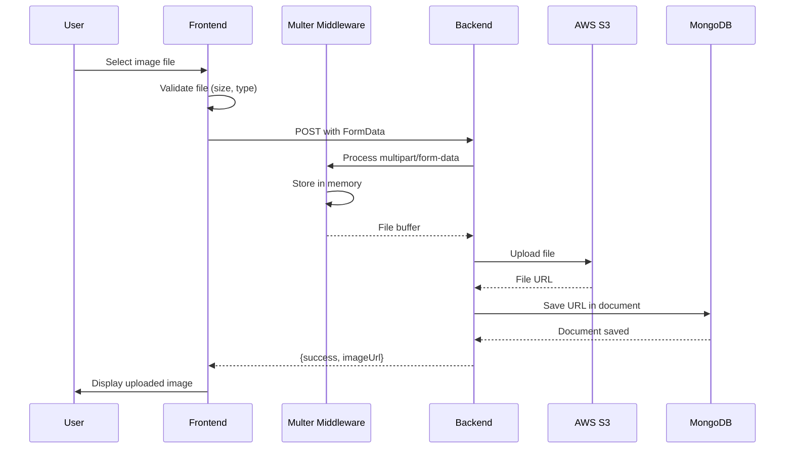
```mermaid
sequenceDiagram
    participant U as User
    participant F as Frontend
    participant M as Multer Middleware
    participant BE as Backend
    participant S3 as AWS S3
    participant DB as MongoDB

    U->>F: Select image file
    F->>F: Validate file (size, type)
    F->>BE: POST with FormData
    BE->>M: Process multipart/form-data
    M->>M: Store in memory
    M-->>BE: File buffer
    BE->>S3: Upload file
    S3-->>BE: File URL
    BE->>DB: Save URL in document
    DB-->>BE: Document saved
    BE-->>F: {success, imageUrl}
    F->>U: Display uploaded image
```

---

## 17. Pagination Flow

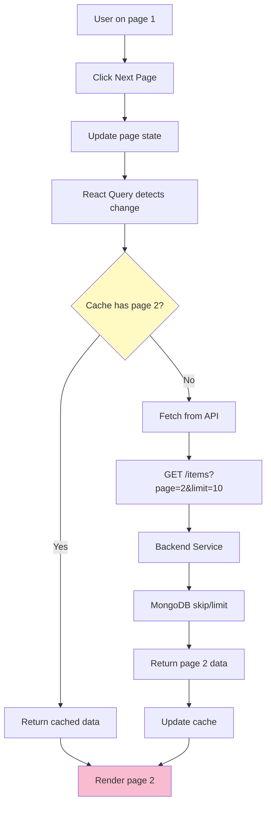
```mermaid
flowchart TD
    A[User on page 1] --> B[Click Next Page]
    B --> C[Update page state]
    C --> D[React Query detects change]
    D --> E{Cache has page 2?}
    E -->|Yes| F[Return cached data]
    E -->|No| G[Fetch from API]
    G --> H[GET /items?page=2&limit=10]
    H --> I[Backend Service]
    I --> J[MongoDB skip/limit]
    J --> K[Return page 2 data]
    K --> L[Update cache]
    F --> M[Render page 2]
    L --> M
    
    style E fill:#fff9c4
    style M fill:#f8bbd0
```

---

## 18. Search and Filter Flow

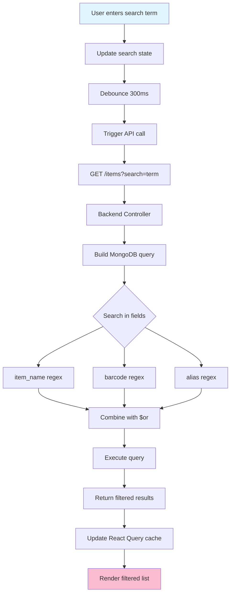
```mermaid
flowchart TD
    A[User enters search term] --> B[Update search state]
    B --> C[Debounce 300ms]
    C --> D[Trigger API call]
    D --> E[GET /items?search=term]
    E --> F[Backend Controller]
    F --> G[Build MongoDB query]
    G --> H{Search in fields}
    H --> I[item_name regex]
    H --> J[barcode regex]
    H --> K[alias regex]
    I --> L[Combine with $or]
    J --> L
    K --> L
    L --> M[Execute query]
    M --> N[Return filtered results]
    N --> O[Update React Query cache]
    O --> P[Render filtered list]
    
    style A fill:#e1f5ff
    style P fill:#f8bbd0
```

---

## 19. Optimistic Update Flow

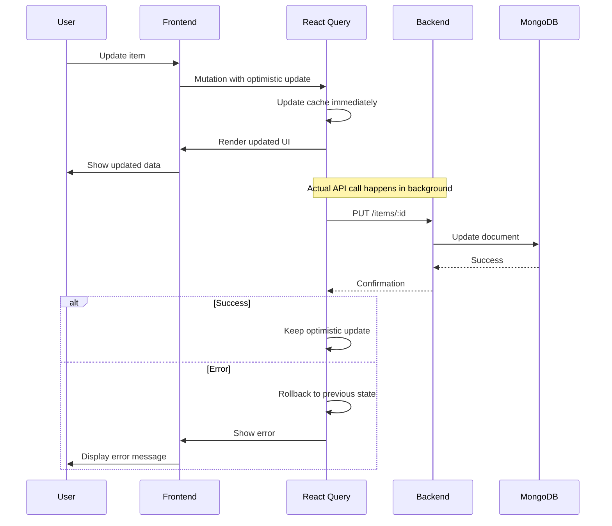
```mermaid
sequenceDiagram
    participant U as User
    participant F as Frontend
    participant RQ as React Query
    participant BE as Backend
    participant DB as MongoDB

    U->>F: Update item
    F->>RQ: Mutation with optimistic update
    RQ->>RQ: Update cache immediately
    RQ->>F: Render updated UI
    F->>U: Show updated data
    
    Note over RQ,BE: Actual API call happens in background
    
    RQ->>BE: PUT /items/:id
    BE->>DB: Update document
    DB-->>BE: Success
    BE-->>RQ: Confirmation
    
    alt Success
        RQ->>RQ: Keep optimistic update
    else Error
        RQ->>RQ: Rollback to previous state
        RQ->>F: Show error
        F->>U: Display error message
    end
```

---

## 20. Complete Request-Response Cycle

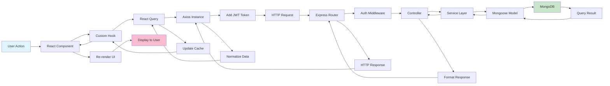
```mermaid
flowchart LR
    A[User Action] --> B[React Component]
    B --> C[Custom Hook]
    C --> D[React Query]
    D --> E[Axios Instance]
    E --> F[Add JWT Token]
    F --> G[HTTP Request]
    G --> H[Express Router]
    H --> I[Auth Middleware]
    I --> J[Controller]
    J --> K[Service Layer]
    K --> L[Mongoose Model]
    L --> M[MongoDB]
    M --> N[Query Result]
    N --> L
    L --> K
    K --> J
    J --> O[Format Response]
    O --> H
    H --> P[HTTP Response]
    P --> E
    E --> Q[Normalize Data]
    Q --> D
    D --> R[Update Cache]
    R --> C
    C --> B
    B --> S[Re-render UI]
    S --> T[Display to User]
    
    style A fill:#e1f5ff
    style M fill:#c8e6c9
    style T fill:#f8bbd0
```

---

## Summary

The data flow architecture demonstrates:

✅ **Clear separation of concerns** - Frontend, Backend, Database layers
✅ **Secure authentication** - JWT-based with automatic token management
✅ **Efficient caching** - React Query for server state, Zustand for client state
✅ **Multi-tenancy support** - User-based data isolation
✅ **Dual firm context** - GST/Non-GST separation
✅ **Real-time calculations** - Stock, payments, balances
✅ **Error handling** - Comprehensive error flows
✅ **Optimistic updates** - Better UX with rollback support
✅ **Background jobs** - Automated bill generation
✅ **File management** - S3 integration for images

This architecture ensures data consistency, security, and optimal performance across the entire application stack.
