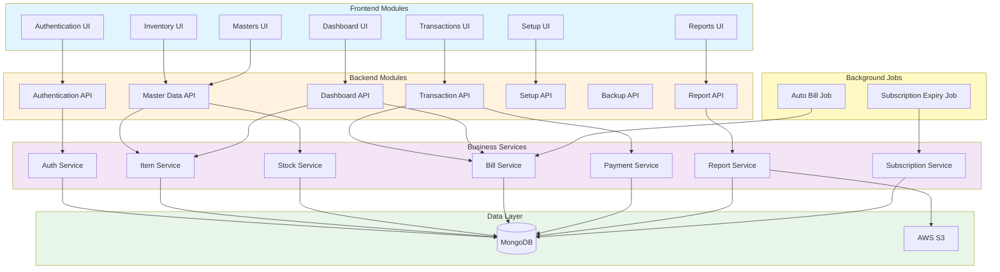

# Module Breakdown

## Overview

This document provides a comprehensive breakdown of all modules in the Maheshwari Motors system, their responsibilities, and how they interact with each other.

---

## Module Architecture



---

## 1. Authentication Module

### 1.1 Frontend Component

**Location:** `frontend/src/pages/auth/`

**Pages:**
- `Login.jsx` - User login page

**Responsibilities:**
- User login form
- Credential validation
- Token storage
- Firm selection
- Session management UI

**Key Features:**
- Admin login
- Firm login (GST/Non-GST)
- Remember me functionality
- Error handling
- Redirect after login

**State Management:**
- Zustand: `user`, `isAuthenticated`, `selectedFirm`
- LocalStorage: `token`

### 1.2 Backend Component

**Location:** `backend/src/`

**Files:**
- Routes: `routers/auth/auth.routes.js`, `routers/auth/admin.routes.js`
- Controllers: `controllers/auth/auth.controller.js`, `controllers/auth/admin.controller.js`
- Services: `services/auth/auth.service.js`, `services/auth/admin.service.js`
- Models: `models/auth/user.model.js`, `models/auth/session.model.js`
- Middleware: `middlewares/auth.middleware.js`

**Responsibilities:**
- User authentication
- JWT token generation
- Session creation and management
- Password hashing and verification
- Multi-device session tracking
- Signature upload/update

**API Endpoints:**
- `POST /api/v1/auth/admin/register` - Register main user
- `POST /api/v1/auth/login` - Login (admin/firm)
- `POST /api/v1/auth/logout` - Logout
- `GET /api/v1/auth/me` - Get current user profile
- `PUT /api/v1/auth/change-password` - Change password
- `GET /api/v1/auth/sessions` - Get all sessions
- `DELETE /api/v1/auth/sessions/:id` - Revoke session
- `POST /api/v1/auth/signature` - Upload signature
- `PUT /api/v1/auth/signature` - Update signature

**Interactions:**
- **With:** User Model, Session Model, Bank Model, Contact Model
- **Calls:** S3 Service (for signature upload)
- **Called By:** All protected routes (via middleware)

---

## 2. Dashboard Module

### 2.1 Frontend Component

**Location:** `frontend/src/pages/core/`

**Pages:**
- `Dashboard.jsx` - Main dashboard

**Responsibilities:**
- Display business metrics
- Show recent activity
- Quick navigation
- Real-time statistics

**Key Features:**
- Total challans count
- Total bills count
- Low stock alerts
- Recent challans list
- Recent bills list
- Quick action buttons

**Data Sources:**
- React Query: `useQueries` for parallel data fetching
- API: `/challans`, `/bills`, `/items/low-stock`

### 2.2 Backend Component

**Location:** `backend/src/`

**Files:**
- Routes: `routers/dashboard/dashboard.routes.js`
- Controllers: `controllers/dashboard/dashboard.controller.js`
- Services: `services/dashboard/dashboard.service.js`

**Responsibilities:**
- Aggregate business metrics
- Calculate statistics
- Fetch recent transactions
- Generate summary data

**API Endpoints:**
- `GET /api/v1/dashboard` - Get dashboard data
- `GET /api/v1/dashboard/firm` - Get firm-specific dashboard

**Interactions:**
- **With:** Challan Model, Bill Model, Item Model, Contact Model
- **Aggregates:** Transaction data, stock data
- **Called By:** Dashboard UI

---

## 3. Inventory Module

### 3.1 Frontend Component

**Location:** `frontend/src/pages/inventory/`

**Pages:**
- `ItemMaster.jsx` - Item list
- `AddItem.jsx` - Add new item
- `ItemUpdate.jsx` - Update item
- `ItemView.jsx` - View item details
- `StockAlertMaster.jsx` - Low stock alerts
- `CategoryMaster.jsx` - Brand management
- `ViewCategory.jsx` - View brand details
- `LabelMaster.jsx` - Label management
- `DepartmentMaster.jsx` - Department management
- `AddSupplier.jsx` - Add supplier
- `ViewAllSupplier.jsx` - Supplier list

**Responsibilities:**
- Item CRUD operations
- Stock management
- Low stock monitoring
- Category/Brand management
- Label/Pricing management
- Department management
- Supplier management

**Key Features:**
- Item search and filter
- Barcode generation
- Image upload
- Stock updates
- Batch operations
- Low stock alerts

**Custom Hooks:**
- `useItems()` - Fetch items
- `useAllItems()` - Fetch all items
- `useLowStockItems()` - Fetch low stock items
- `useBatchUpdateItems()` - Batch update
- `useUpdateItem()` - Update single item

### 3.2 Backend Component

**Location:** `backend/src/`

**Files:**
- Routes: `routers/master/item.routes.js`, `routers/master/brand.routes.js`, `routers/master/label.routes.js`, `routers/master/department.route.js`
- Controllers: `controllers/master/item.controller.js`, `controllers/master/brand.controller.js`, `controllers/master/label.controller.js`, `controllers/master/department.controller.js`
- Services: `services/master/item.service.js`, `services/master/brand.service.js`, `services/master/label.service.js`, `services/master/department.service.js`, `services/inventory/stock.service.js`
- Models: `models/master/item.model.js`, `models/master/brand.model.js`, `models/master/label.model.js`, `models/master/department.model.js`

**Responsibilities:**
- Item CRUD operations
- Stock calculations
- Barcode generation
- Image upload to S3
- Low stock detection
- Batch updates
- Brand management
- Label management
- Department management

**API Endpoints:**
- `GET /api/v1/items` - Get items
- `POST /api/v1/items` - Create item
- `GET /api/v1/items/low-stock` - Get low stock items
- `PUT /api/v1/items/batch-update` - Batch update
- `GET /api/v1/items/:id` - Get item by ID
- `PUT /api/v1/items/:id` - Update item
- `DELETE /api/v1/items/:id` - Delete item
- `PATCH /api/v1/items/:id/stock` - Update stock
- `POST /api/v1/items/check-barcode` - Check barcode uniqueness

**Interactions:**
- **With:** Brand Model, Department Model, HSN Model, Contact Model
- **Calls:** S3 Service, Counter Helper, Stock Service
- **Called By:** Inventory UI, Transaction Module (for stock updates)

---

## 4. Master Data Module

### 4.1 Frontend Component

**Location:** `frontend/src/pages/masters/`

**Pages:**
- `FirmMaster.jsx` - Firm management
- `UserMaster.jsx` - User management
- `AccountMaster.jsx` - Account management
- `PartyMaster.jsx` - Party/Customer management
- `BrandMaster.jsx` - Brand management
- `DiscountMaster.jsx` - Discount configuration
- `AgentMaster.jsx` - Sales agent management
- `TransportMaster.jsx` - Transport company management
- `HsnMaster.jsx` - HSN code management
- `AreaMaster.jsx` - Area/region management
- `BankMaster.jsx` - Bank account management
- `TransactionMaster.jsx` - Transaction management
- `ReturnMaster.jsx` - Return management

**Responsibilities:**
- CRUD operations for all master entities
- Data validation
- Relationship management
- Search and filter
- Pagination

**Custom Hooks:**
- `useAllBrands()` - Fetch all brands
- `useBrands()` - Fetch brands with filters
- `useHsns()` - Fetch HSN codes
- `useDepartments()` - Fetch departments
- `useAgents()` - Fetch agents
- `useTransports()` - Fetch transporters
- `useAreas()` - Fetch areas
- `useBanks()` - Fetch banks
- `useContacts()` - Fetch contacts
- `useLabels()` - Fetch labels

### 4.2 Backend Component

**Location:** `backend/src/`

**Files:**
- Routes: `routers/master/*.routes.js`
- Controllers: `controllers/master/*.controller.js`
- Services: `services/master/*.service.js`
- Models: `models/master/*.model.js`

**Entities:**
- Agent
- Area
- Bank
- Brand
- Contact (Party/Supplier/Book)
- Department
- HSN
- Label
- Transport

**Responsibilities:**
- CRUD operations for master data
- Data validation
- Relationship management
- Search and filter
- Pagination
- Counter generation

**API Endpoints (Pattern):**
- `GET /api/v1/{entity}` - Get all
- `POST /api/v1/{entity}` - Create
- `GET /api/v1/{entity}/:id` - Get by ID
- `PUT /api/v1/{entity}/:id` - Update
- `DELETE /api/v1/{entity}/:id` - Delete

**Interactions:**
- **With:** All master models
- **Calls:** Counter Helper
- **Called By:** Master UI, Transaction Module (for lookups)

---

## 5. Transaction Module

### 5.1 Frontend Component

**Location:** `frontend/src/pages/transactions/`

**Pages:**
- `ChallanList.jsx` - Challan list
- `ChallanForm.jsx` - Create/Edit challan
- `BillList.jsx` - Bill list
- `BillForm.jsx` - Create bill from challans
- `BillAutomation.jsx` - Auto bill generation rules
- `TransactionHistory.jsx` - Transaction history
- `OutStandings.jsx` - Outstanding amounts
- `OutstandingList.jsx` - Outstanding list

**Responsibilities:**
- Challan creation and management
- Bill generation from challans
- Payment recording
- Transaction management
- Outstanding tracking
- Automation rule configuration

**Key Features:**
- Multi-item challan creation
- GST/Non-GST support
- Discount calculations
- Stock updates
- Convert challans to bills
- Payment tracking
- Outstanding reports

### 5.2 Backend Component

**Location:** `backend/src/`

**Files:**
- Routes: `routers/transaction/*.routes.js`
- Controllers: `controllers/transaction/*.controller.js`
- Services: `services/transaction/*.service.js`
- Models: `models/transaction/*.model.js`

**Entities:**
- Challan (Sale/Purchase)
- Bill
- Return (Sale/Purchase)
- Transaction (Cash/Bank)
- AutoBill (Automation Rules)

**Responsibilities:**
- Challan CRUD operations
- Bill generation from challans
- Payment recording
- Stock updates
- Balance calculations
- Return processing
- Transaction recording
- Automation rule management

**API Endpoints:**
- `GET /api/v1/challans` - Get challans
- `POST /api/v1/challans` - Create challan
- `GET /api/v1/challans/:id` - Get challan
- `PUT /api/v1/challans/:id` - Update challan
- `DELETE /api/v1/challans/:id` - Delete challan
- `GET /api/v1/bills` - Get bills
- `POST /api/v1/bills` - Create bill
- `POST /api/v1/bills/:id/payment` - Add payment
- `GET /api/v1/returns` - Get returns
- `POST /api/v1/returns` - Create return
- `GET /api/v1/transactions` - Get transactions
- `POST /api/v1/transactions` - Create transaction
- `GET /api/v1/automation-rules` - Get automation rules
- `POST /api/v1/automation-rules` - Create rule

**Interactions:**
- **With:** Item Model, Contact Model, Label Model, Bank Model, Transport Model
- **Calls:** Stock Service, Counter Helper
- **Updates:** Item stock, Contact balance
- **Called By:** Transaction UI, Auto Bill Job

---

## 6. Report Module

### 6.1 Frontend Component

**Location:** `frontend/src/pages/reports/`

**Pages:**
- `Reports.jsx` - Reports dashboard
- `GSTReport.jsx` - GST report
- `GSTReportDetails.jsx` - GST report details
- `PurchaseReport.jsx` - Purchase report
- `SalesReport.jsx` - Sales report
- `SalesReturnReport.jsx` - Sales return report
- `PurchaseReturnReport.jsx` - Purchase return report
- `ItemLedgerReport.jsx` - Item-wise ledger
- `PurchaseDateWiseReport.jsx` - Date-wise purchase
- `CollectionReport.jsx` - Collection report
- `ProfitLossReport.jsx` - Profit & loss report

**Responsibilities:**
- Report generation
- Date range filtering
- Export to PDF
- Print functionality
- Summary and detailed views

**Key Features:**
- Multiple report types
- Date range selection
- Party-wise reports
- Item-wise reports
- GST calculations
- PDF export
- Print preview

### 6.2 Backend Component

**Location:** `backend/src/`

**Files:**
- Routes: `routers/report/*.routes.js`
- Controllers: `controllers/report/*.controller.js`
- Services: `services/report/*.service.js`
- Models: `models/common/report.model.js`

**Responsibilities:**
- Report data aggregation
- PDF generation
- S3 upload
- Report metadata storage
- Outstanding calculations
- Item ledger tracking

**API Endpoints:**
- `GET /api/v1/reports` - Get reports
- `POST /api/v1/reports/generate` - Generate report
- `GET /api/v1/reports/:id` - Get report by ID
- `GET /api/v1/outstanding` - Get outstanding report
- `GET /api/v1/item-ledger` - Get item ledger

**Interactions:**
- **With:** Challan Model, Bill Model, Return Model, Transaction Model, Item Model
- **Calls:** S3 Service, PDF Generator
- **Called By:** Report UI

---

## 7. Setup Module

### 7.1 Frontend Component

**Location:** `frontend/src/pages/setup/`

**Pages:**
- `BackupRestore.jsx` - Backup and restore
- `FinancialYearClose.jsx` - Financial year closing
- `ChequePrintSetup.jsx` - Cheque print configuration

**Responsibilities:**
- System configuration
- Data backup
- Financial year management
- Cheque printing setup

### 7.2 Backend Component

**Location:** `backend/src/`

**Files:**
- Routes: `routers/setup.routes.js`, `routers/backup.routes.js`
- Controllers: `controllers/setup/setup.controller.js`, `controllers/backup/backup.controller.js`
- Services: `services/setup/setup.service.js`, `services/backup/backup.service.js`

**Responsibilities:**
- System setup
- Data backup and restore
- Configuration management
- Financial year operations

**API Endpoints:**
- `GET /api/v1/setup` - Get setup configuration
- `POST /api/v1/setup` - Update setup
- `POST /api/v1/backup/create` - Create backup
- `POST /api/v1/backup/restore` - Restore backup

**Interactions:**
- **With:** All models (for backup)
- **Calls:** S3 Service
- **Called By:** Setup UI

---

## 8. Subscription Module

### 8.1 Backend Component

**Location:** `backend/src/`

**Files:**
- Services: `services/subscription/subscription.service.js`
- Models: `models/common/subscription.model.js`
- Jobs: `jobs/subscriptionExpiry.cron.js`

**Responsibilities:**
- Subscription management
- Plan activation
- Expiry tracking
- User deactivation on expiry
- Subscription history

**Key Features:**
- Demo and paid plans
- Timeline-based expiry
- Automatic expiry detection
- History tracking
- Admin activation

**Interactions:**
- **With:** User Model, Subscription Model
- **Called By:** Subscription Expiry Job, Admin Service
- **Updates:** User.is_active on expiry

---

## 9. Background Jobs Module

### 9.1 Auto Bill Generation Job

**Location:** `backend/src/jobs/autoBill.cron.js`

**Schedule:** Daily at 00:00 IST

**Responsibilities:**
- Fetch active automation rules
- Check eligible challans
- Validate challan count against threshold
- Generate bills automatically
- Update challans and stock
- Log results

**Process Flow:**
1. Query active automation rules
2. For each rule:
   - Fetch eligible challans (not converted, same party)
   - Check if count >= threshold
   - Validate all same GST type
   - Create bill
   - Update challans (converted_to_bill = true)
   - Update stock if needed
3. Log summary (bills created, rules skipped)

**Interactions:**
- **With:** AutoBill Model, Challan Model, Contact Model
- **Calls:** Bill Service
- **Updates:** Challan documents, Item stock

### 9.2 Subscription Expiry Job

**Location:** `backend/src/jobs/subscriptionExpiry.cron.js`

**Schedule:** Daily at 00:00 IST

**Responsibilities:**
- Check for expired subscriptions
- Mark subscriptions as expired
- Deactivate expired users
- Identify subscriptions expiring today
- Log results

**Process Flow:**
1. Query active subscriptions with expiry_date < today
2. For each expired subscription:
   - Update status = 'expired'
   - Set user.is_active = false
3. Query subscriptions expiring today
4. Log summary (expired count, expiring today count)

**Interactions:**
- **With:** Subscription Model, User Model
- **Calls:** Subscription Service
- **Updates:** Subscription status, User.is_active

---

## 10. Common Services Module

### 10.1 S3 Service

**Location:** `backend/src/services/common/s3.service.js`

**Responsibilities:**
- File upload to S3
- File deletion from S3
- Generate signed URLs
- Manage S3 buckets

**Used By:**
- Auth Service (signature upload)
- Item Service (item images)
- Report Service (PDF reports)

### 10.2 Stock Service

**Location:** `backend/src/services/inventory/stock.service.js`

**Responsibilities:**
- Stock calculations
- Stock updates
- Physical and logical stock management
- Stock movement tracking

**Used By:**
- Item Service
- Challan Service
- Bill Service
- Return Service

### 10.3 Counter Helper

**Location:** `backend/src/helpers/counter.js`

**Responsibilities:**
- Auto-increment ID generation
- Per-user per-model counters
- Atomic counter updates

**Used By:**
- All services that create documents with sequential IDs

### 10.4 Identifier Generator

**Location:** `backend/src/helpers/identifierGenerator.js`

**Responsibilities:**
- Barcode generation
- Item ID generation
- Barcode validation

**Used By:**
- Item Service

---

## Module Interaction Matrix

| Module | Depends On | Called By | Updates |
|--------|-----------|-----------|---------|
| **Authentication** | User, Session, Bank, Contact | All protected routes | User, Session |
| **Dashboard** | Challan, Bill, Item, Contact | Dashboard UI | None |
| **Inventory** | Item, Brand, Department, HSN, Contact | Inventory UI, Transaction | Item, Brand |
| **Master Data** | All master models | Master UI, Transaction, Inventory | Master models |
| **Transaction** | Challan, Bill, Return, Transaction, Item, Contact | Transaction UI, Auto Bill Job | Challan, Bill, Item stock, Contact balance |
| **Report** | Challan, Bill, Return, Transaction, Item | Report UI | Report |
| **Setup** | All models | Setup UI | Configuration |
| **Subscription** | Subscription, User | Subscription Job, Admin | Subscription, User |
| **Auto Bill Job** | AutoBill, Challan, Contact | Cron Scheduler | Challan, Bill, Item stock |
| **Subscription Job** | Subscription, User | Cron Scheduler | Subscription, User |
| **S3 Service** | AWS S3 | Auth, Item, Report | S3 Bucket |
| **Stock Service** | Item | Challan, Bill, Return | Item stock |
| **Counter Helper** | Counter | All create operations | Counter |

---

## Data Flow Between Modules

### 1. Item Creation Flow
```
Inventory UI → Item Service → Counter Helper → Item Model → Database
                ↓
            S3 Service → AWS S3
                ↓
            Brand Service → Brand Model → Database
```

### 2. Challan to Bill Flow
```
Transaction UI → Bill Service → Challan Model → Database
                    ↓
                Stock Service → Item Model → Database
                    ↓
                Counter Helper → Counter Model → Database
```

### 3. Payment Recording Flow
```
Transaction UI → Bill Service → Bill Model → Database
                    ↓
                Contact Service → Contact Model → Database
```

### 4. Report Generation Flow
```
Report UI → Report Service → Challan/Bill Models → Database
                ↓
            PDF Generator → PDF Buffer
                ↓
            S3 Service → AWS S3
                ↓
            Report Model → Database
```

### 5. Auto Bill Generation Flow
```
Cron Scheduler → Auto Bill Job → AutoBill Model → Database
                    ↓
                Challan Model → Database
                    ↓
                Bill Service → Bill Model → Database
                    ↓
                Stock Service → Item Model → Database
```

---

## Module Dependencies

### Frontend Dependencies
```
Authentication UI
    ↓
Dashboard UI → Inventory UI → Master Data UI → Transaction UI → Report UI
    ↓              ↓              ↓                ↓              ↓
Common Components (DataTable, Modal, StatsCard, etc.)
    ↓
Custom Hooks (useItems, useMasters, useDashboard)
    ↓
Axios Instance (HTTP Client)
    ↓
Backend API
```

### Backend Dependencies
```
Routes
    ↓
Middlewares (Auth, Error)
    ↓
Controllers
    ↓
Services
    ↓
Models
    ↓
Database
```

---

## Module Communication Patterns

### 1. **Synchronous Communication**
- Frontend → Backend: HTTP REST API
- Controller → Service: Direct function calls
- Service → Model: Mongoose methods
- Model → Database: MongoDB queries

### 2. **Asynchronous Communication**
- Background Jobs → Services: Scheduled execution
- React Query → API: Automatic refetching
- Optimistic Updates → Cache: Immediate UI update

### 3. **Event-Driven Communication**
- Cron Jobs: Time-based triggers
- React Query: Cache invalidation events
- Zustand: State change notifications

---

## Module Scalability

### Current State (Monolithic)
All modules are tightly coupled in a single codebase.

### Future Microservices Architecture

If the system needs to scale, modules can be separated into microservices:

1. **Auth Service** - Authentication and authorization
2. **Inventory Service** - Items, stock, alerts
3. **Transaction Service** - Challans, bills, payments
4. **Report Service** - Report generation
5. **Master Data Service** - All master entities
6. **Notification Service** - Email, SMS, push notifications
7. **File Service** - S3 file management
8. **Subscription Service** - Subscription management

**Communication:** REST API or Message Queue (RabbitMQ/Kafka)

---

## Conclusion

The Maheshwari Motors system is organized into **10 major modules** with clear responsibilities and well-defined interactions. The modular architecture allows for:

✅ **Clear separation of concerns**
✅ **Independent development and testing**
✅ **Easy maintenance and debugging**
✅ **Scalability through module separation**
✅ **Reusable components and services**
✅ **Consistent patterns across modules**

Each module follows the same architectural pattern:
- **Frontend:** Pages → Components → Hooks → API
- **Backend:** Routes → Controllers → Services → Models → Database

This consistency makes the codebase **easy to understand, maintain, and extend**.
