# RBAC Flow Diagrams

## 1. Login Flow with Roles

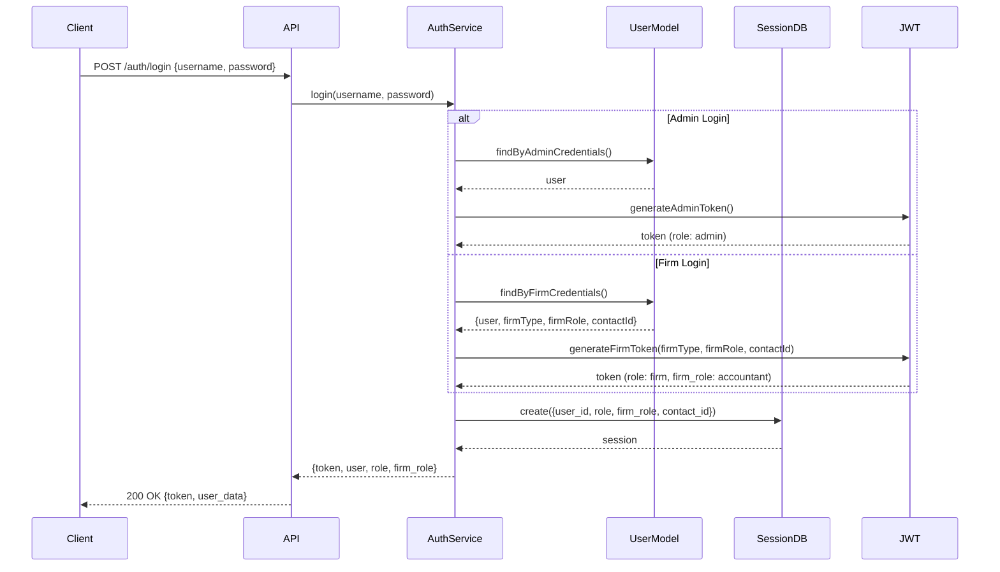

## 2. Request Authorization Flow

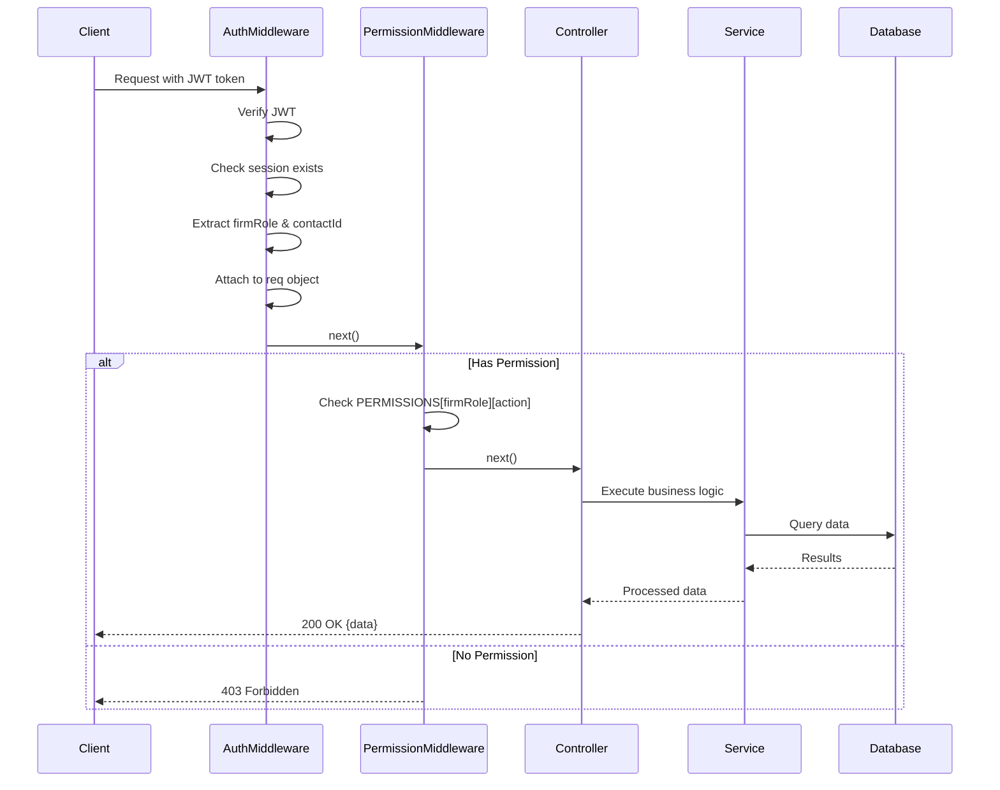

## 3. Role Permission Matrix

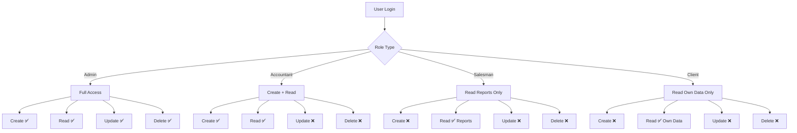

## 4. Client Data Filtering Flow

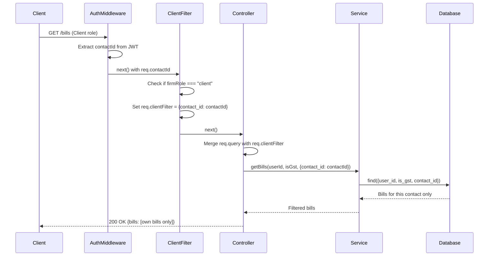

## 5. Item View Filtering for Client

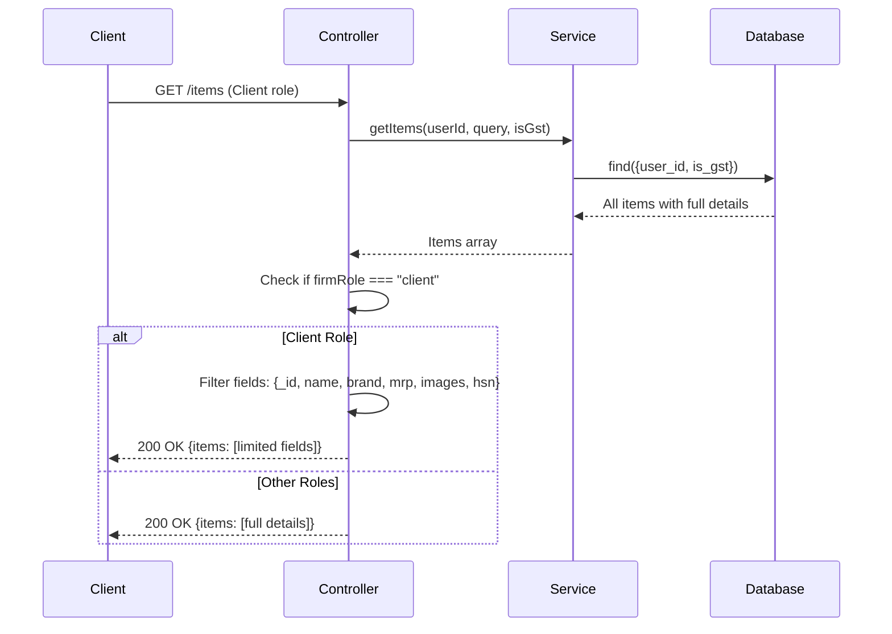

## 6. Permission Check Flow

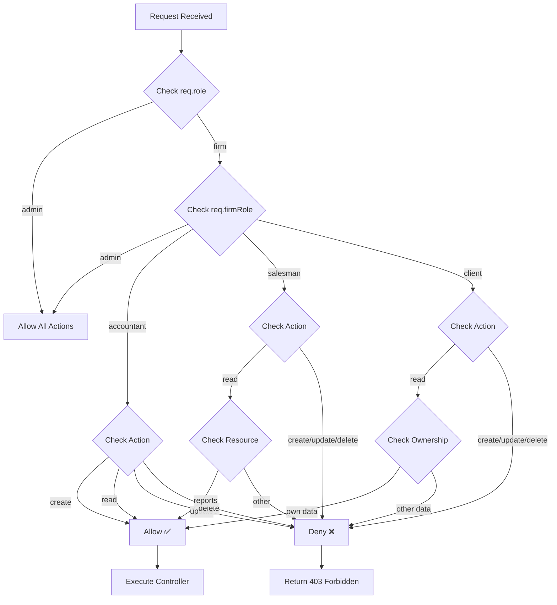

## 7. Database Schema Structure

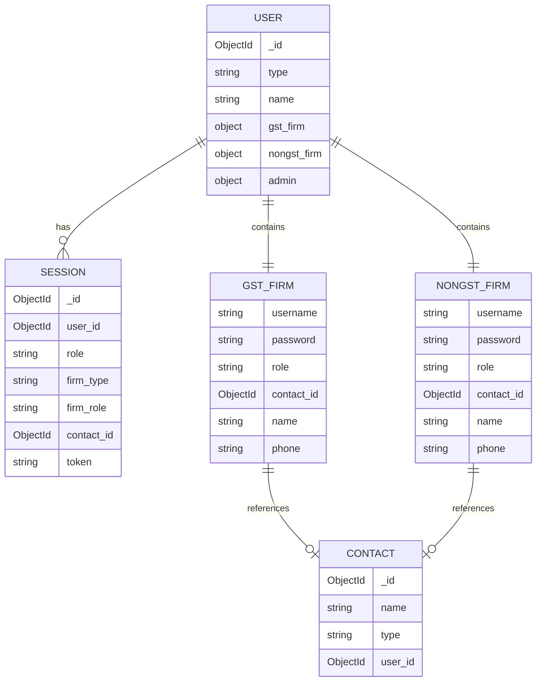

## 8. JWT Token Structure

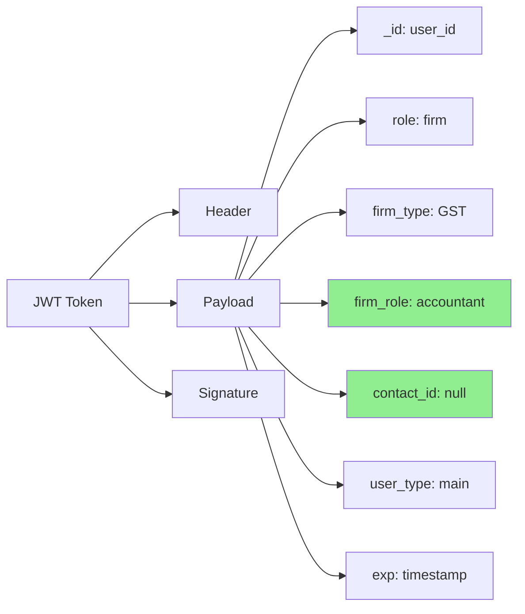

## 9. Role-Based UI Rendering

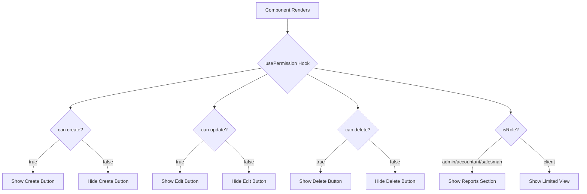

## 10. Complete RBAC Architecture

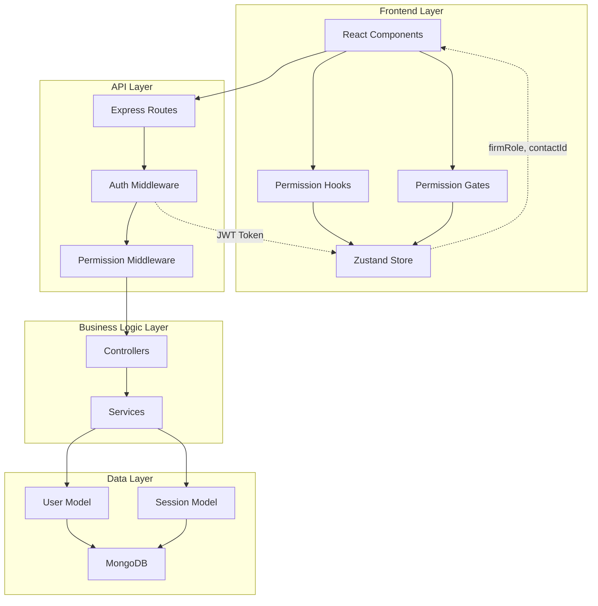

## 11. Migration Process Flow

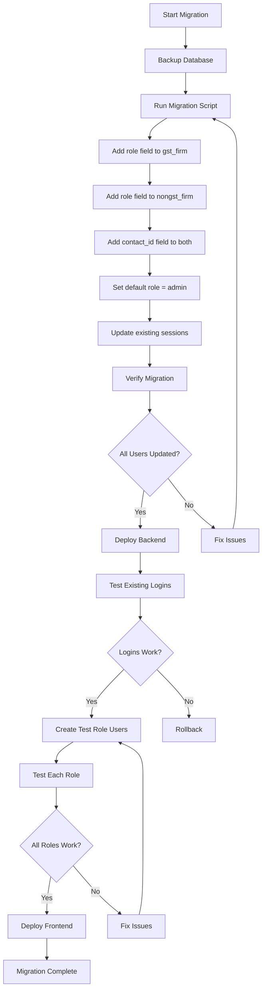

## 12. Error Handling Flow

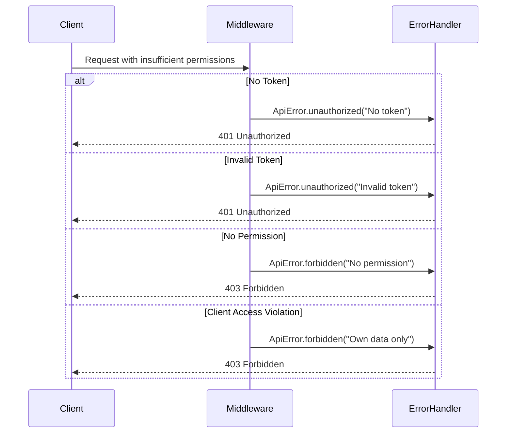

## Summary

These diagrams illustrate:

1. **Login Flow**: How roles are extracted and tokens generated
2. **Authorization Flow**: How permissions are checked on each request
3. **Permission Matrix**: Visual representation of role capabilities
4. **Client Filtering**: How client data is isolated
5. **Item Filtering**: How clients see limited item data
6. **Permission Checks**: Decision tree for access control
7. **Database Schema**: How roles are stored
8. **JWT Structure**: What's inside the token
9. **UI Rendering**: How frontend uses permissions
10. **Complete Architecture**: Full system overview
11. **Migration Process**: Step-by-step migration flow
12. **Error Handling**: How errors are processed

All flows are optimized for performance with zero additional database queries during authorization checks.
