# Sequence Diagrams

## Overview

This document contains detailed sequence diagrams for all critical business flows in the Maheshwari Motors inventory and billing management system.

---

## 1. Authentication Flow - Admin Login

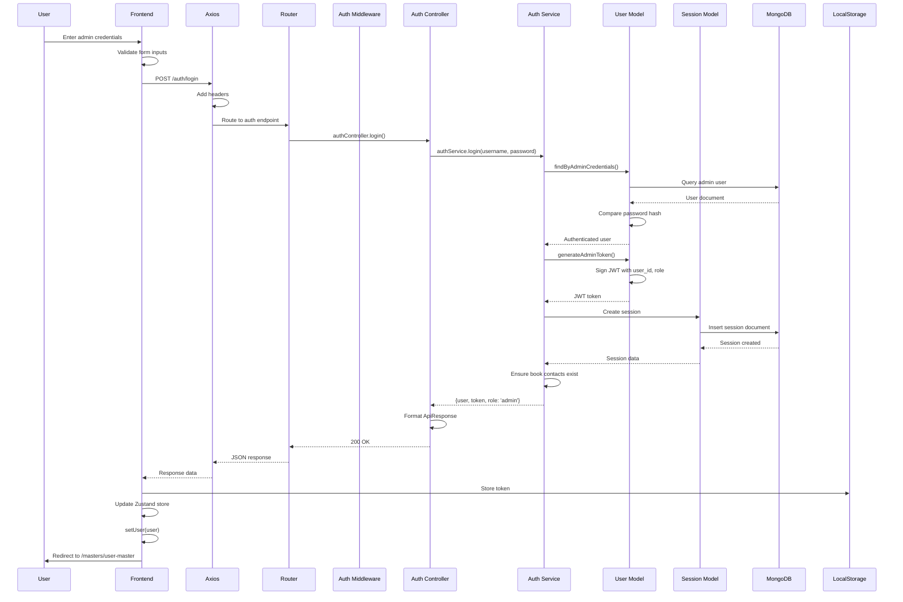
```mermaid
sequenceDiagram
    participant U as User
    participant F as Frontend
    participant A as Axios
    participant R as Router
    participant AM as Auth Middleware
    participant AC as Auth Controller
    participant AS as Auth Service
    participant UM as User Model
    participant SM as Session Model
    participant DB as MongoDB
    participant LS as LocalStorage

    U->>F: Enter admin credentials
    F->>F: Validate form inputs
    F->>A: POST /auth/login
    A->>A: Add headers
    A->>R: Route to auth endpoint
    R->>AC: authController.login()
    AC->>AS: authService.login(username, password)
    AS->>UM: findByAdminCredentials()
    UM->>DB: Query admin user
    DB-->>UM: User document
    UM->>UM: Compare password hash
    UM-->>AS: Authenticated user
    AS->>UM: generateAdminToken()
    UM->>UM: Sign JWT with user_id, role
    UM-->>AS: JWT token
    AS->>SM: Create session
    SM->>DB: Insert session document
    DB-->>SM: Session created
    SM-->>AS: Session data
    AS->>AS: Ensure book contacts exist
    AS-->>AC: {user, token, role: 'admin'}
    AC->>AC: Format ApiResponse
    AC-->>R: 200 OK
    R-->>A: JSON response
    A-->>F: Response data
    F->>LS: Store token
    F->>F: Update Zustand store
    F->>F: setUser(user)
    F->>U: Redirect to /masters/user-master
```

---

## 2. Authentication Flow - Firm Login

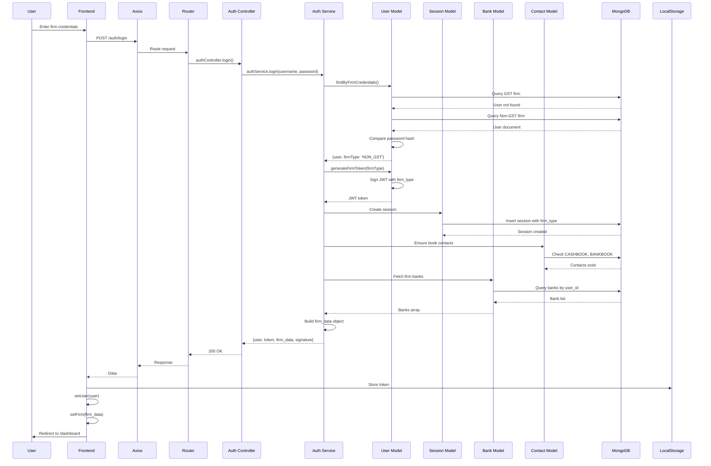
```mermaid
sequenceDiagram
    participant U as User
    participant F as Frontend
    participant A as Axios
    participant R as Router
    participant AC as Auth Controller
    participant AS as Auth Service
    participant UM as User Model
    participant SM as Session Model
    participant BM as Bank Model
    participant CM as Contact Model
    participant DB as MongoDB
    participant LS as LocalStorage

    U->>F: Enter firm credentials
    F->>A: POST /auth/login
    A->>R: Route request
    R->>AC: authController.login()
    AC->>AS: authService.login(username, password)
    AS->>UM: findByFirmCredentials()
    UM->>DB: Query GST firm
    DB-->>UM: User not found
    UM->>DB: Query Non-GST firm
    DB-->>UM: User document
    UM->>UM: Compare password hash
    UM-->>AS: {user, firmType: 'NON_GST'}
    AS->>UM: generateFirmToken(firmType)
    UM->>UM: Sign JWT with firm_type
    UM-->>AS: JWT token
    AS->>SM: Create session
    SM->>DB: Insert session with firm_type
    DB-->>SM: Session created
    AS->>CM: Ensure book contacts
    CM->>DB: Check CASHBOOK, BANKBOOK
    DB-->>CM: Contacts exist
    AS->>BM: Fetch firm banks
    BM->>DB: Query banks by user_id
    DB-->>BM: Bank list
    BM-->>AS: Banks array
    AS->>AS: Build firm_data object
    AS-->>AC: {user, token, firm_data, signature}
    AC-->>R: 200 OK
    R-->>A: Response
    A-->>F: Data
    F->>LS: Store token
    F->>F: setUser(user)
    F->>F: setFirm(firm_data)
    F->>U: Redirect to /dashboard
```

---

## 3. Item Creation Flow

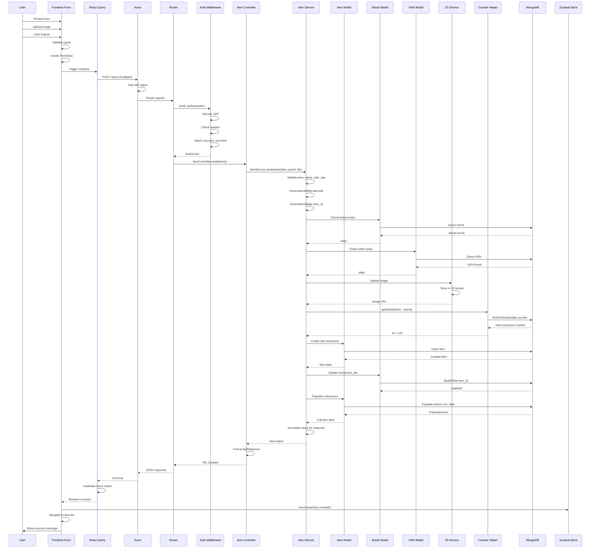
```mermaid
sequenceDiagram
    participant U as User
    participant F as Frontend Form
    participant RQ as React Query
    participant A as Axios
    participant R as Router
    participant AM as Auth Middleware
    participant IC as Item Controller
    participant IS as Item Service
    participant IM as Item Model
    participant BM as Brand Model
    participant HM as HSN Model
    participant S3 as S3 Service
    participant CH as Counter Helper
    participant DB as MongoDB
    participant Z as Zustand Store

    U->>F: Fill item form
    U->>F: Upload image
    U->>F: Click Submit
    F->>F: Validate inputs
    F->>F: Create FormData
    F->>RQ: Trigger mutation
    RQ->>A: POST /items (multipart)
    A->>A: Add JWT token
    A->>R: Route request
    R->>AM: Verify authentication
    AM->>AM: Decode JWT
    AM->>AM: Check session
    AM->>AM: Attach req.user, req.isGst
    AM-->>R: Authorized
    R->>IC: itemController.createItem()
    IC->>IS: itemService.createItem(data, userId, file)
    IS->>IS: Validate item_name, sale_rate
    IS->>IS: Generate/validate barcode
    IS->>IS: Generate/validate item_id
    IS->>BM: Check brand exists
    BM->>DB: Query brand
    DB-->>BM: Brand found
    BM-->>IS: Valid
    IS->>HM: Check HSN exists
    HM->>DB: Query HSN
    DB-->>HM: HSN found
    HM-->>IS: Valid
    IS->>S3: Upload image
    S3->>S3: Store in S3 bucket
    S3-->>IS: Image URL
    IS->>CH: getNextId('Item', userId)
    CH->>DB: findOneAndUpdate counter
    DB-->>CH: Next sequence number
    CH-->>IS: id = 123
    IS->>IM: Create item document
    IM->>DB: Insert item
    DB-->>IM: Created item
    IM-->>IS: Item data
    IS->>BM: Update brand.item_ids
    BM->>DB: $addToSet item_id
    DB-->>BM: Updated
    IS->>IM: Populate references
    IM->>DB: Populate brand, hsn, dept
    DB-->>IM: Populated item
    IM-->>IS: Full item data
    IS->>IS: Normalize stock for response
    IS-->>IC: Item object
    IC->>IC: Format ApiResponse
    IC-->>R: 201 Created
    R-->>A: JSON response
    A-->>RQ: Success
    RQ->>RQ: Invalidate items cache
    RQ-->>F: Mutation success
    F->>Z: showToast('Item created')
    F->>F: Navigate to item list
    F->>U: Show success message
```

---

## 4. Challan Creation Flow (Sale)

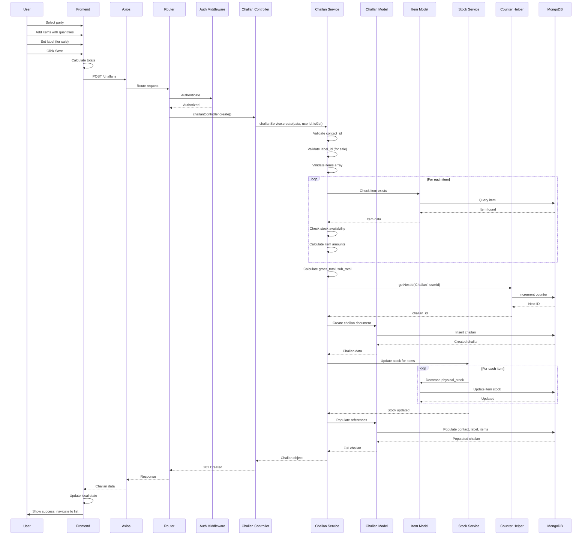
```mermaid
sequenceDiagram
    participant U as User
    participant F as Frontend
    participant A as Axios
    participant R as Router
    participant AM as Auth Middleware
    participant CC as Challan Controller
    participant CS as Challan Service
    participant CM as Challan Model
    participant IM as Item Model
    participant SS as Stock Service
    participant CH as Counter Helper
    participant DB as MongoDB

    U->>F: Select party
    U->>F: Add items with quantities
    U->>F: Set label (for sale)
    U->>F: Click Save
    F->>F: Calculate totals
    F->>A: POST /challans
    A->>R: Route request
    R->>AM: Authenticate
    AM-->>R: Authorized
    R->>CC: challanController.create()
    CC->>CS: challanService.create(data, userId, isGst)
    CS->>CS: Validate contact_id
    CS->>CS: Validate label_id (for sale)
    CS->>CS: Validate items array
    
    loop For each item
        CS->>IM: Check item exists
        IM->>DB: Query item
        DB-->>IM: Item found
        IM-->>CS: Item data
        CS->>CS: Check stock availability
        CS->>CS: Calculate item amounts
    end
    
    CS->>CS: Calculate gross_total, sub_total
    CS->>CH: getNextId('Challan', userId)
    CH->>DB: Increment counter
    DB-->>CH: Next ID
    CH-->>CS: challan_id
    CS->>CM: Create challan document
    CM->>DB: Insert challan
    DB-->>CM: Created challan
    CM-->>CS: Challan data
    
    CS->>SS: Update stock for items
    
    loop For each item
        SS->>IM: Decrease physical_stock
        IM->>DB: Update item stock
        DB-->>IM: Updated
    end
    
    SS-->>CS: Stock updated
    CS->>CM: Populate references
    CM->>DB: Populate contact, label, items
    DB-->>CM: Populated challan
    CM-->>CS: Full challan
    CS-->>CC: Challan object
    CC-->>R: 201 Created
    R-->>A: Response
    A-->>F: Challan data
    F->>F: Update local state
    F->>U: Show success, navigate to list
```

---

## 5. Bill Generation from Challans

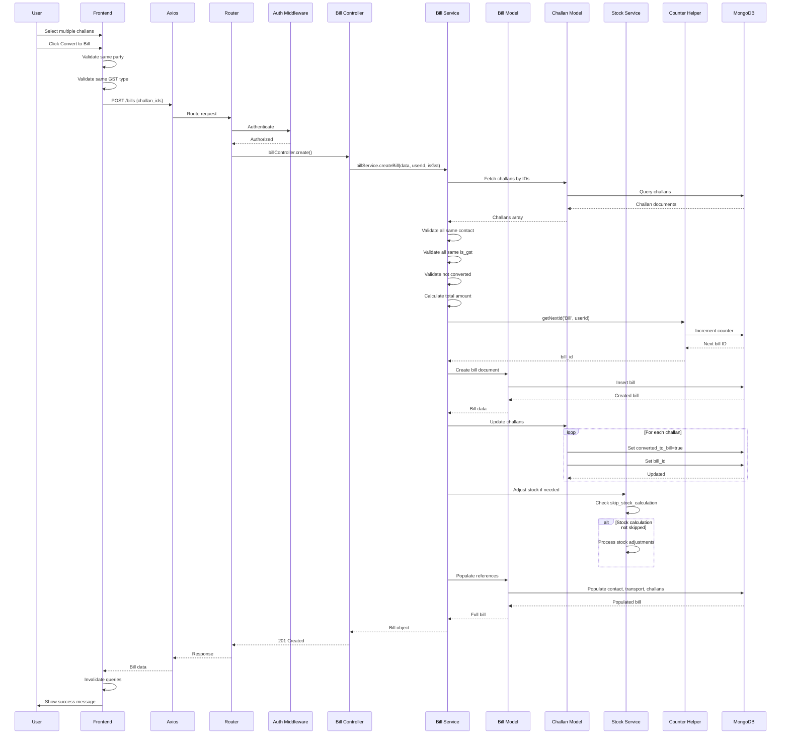
```mermaid
sequenceDiagram
    participant U as User
    participant F as Frontend
    participant A as Axios
    participant R as Router
    participant AM as Auth Middleware
    participant BC as Bill Controller
    participant BS as Bill Service
    participant BM as Bill Model
    participant CM as Challan Model
    participant SS as Stock Service
    participant CH as Counter Helper
    participant DB as MongoDB

    U->>F: Select multiple challans
    U->>F: Click Convert to Bill
    F->>F: Validate same party
    F->>F: Validate same GST type
    F->>A: POST /bills {challan_ids}
    A->>R: Route request
    R->>AM: Authenticate
    AM-->>R: Authorized
    R->>BC: billController.create()
    BC->>BS: billService.createBill(data, userId, isGst)
    BS->>CM: Fetch challans by IDs
    CM->>DB: Query challans
    DB-->>CM: Challan documents
    CM-->>BS: Challans array
    BS->>BS: Validate all same contact
    BS->>BS: Validate all same is_gst
    BS->>BS: Validate not converted
    BS->>BS: Calculate total amount
    BS->>CH: getNextId('Bill', userId)
    CH->>DB: Increment counter
    DB-->>CH: Next bill ID
    CH-->>BS: bill_id
    BS->>BM: Create bill document
    BM->>DB: Insert bill
    DB-->>BM: Created bill
    BM-->>BS: Bill data
    
    BS->>CM: Update challans
    
    loop For each challan
        CM->>DB: Set converted_to_bill=true
        CM->>DB: Set bill_id
        DB-->>CM: Updated
    end
    
    BS->>SS: Adjust stock if needed
    SS->>SS: Check skip_stock_calculation
    
    alt Stock calculation not skipped
        SS->>SS: Process stock adjustments
    end
    
    BS->>BM: Populate references
    BM->>DB: Populate contact, transport, challans
    DB-->>BM: Populated bill
    BM-->>BS: Full bill
    BS-->>BC: Bill object
    BC-->>R: 201 Created
    R-->>A: Response
    A-->>F: Bill data
    F->>F: Invalidate queries
    F->>U: Show success message
```

---

## 6. Payment Recording Flow

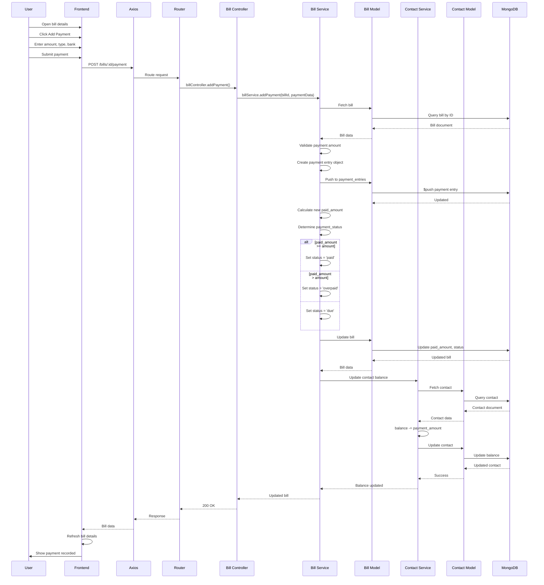
```mermaid
sequenceDiagram
    participant U as User
    participant F as Frontend
    participant A as Axios
    participant R as Router
    participant BC as Bill Controller
    participant BS as Bill Service
    participant BM as Bill Model
    participant CS as Contact Service
    participant CM as Contact Model
    participant DB as MongoDB

    U->>F: Open bill details
    U->>F: Click Add Payment
    U->>F: Enter amount, type, bank
    U->>F: Submit payment
    F->>A: POST /bills/:id/payment
    A->>R: Route request
    R->>BC: billController.addPayment()
    BC->>BS: billService.addPayment(billId, paymentData)
    BS->>BM: Fetch bill
    BM->>DB: Query bill by ID
    DB-->>BM: Bill document
    BM-->>BS: Bill data
    BS->>BS: Validate payment amount
    BS->>BS: Create payment entry object
    BS->>BM: Push to payment_entries
    BM->>DB: $push payment entry
    DB-->>BM: Updated
    BS->>BS: Calculate new paid_amount
    BS->>BS: Determine payment_status
    
    alt paid_amount >= amount
        BS->>BS: Set status = 'paid'
    else paid_amount > amount
        BS->>BS: Set status = 'overpaid'
    else
        BS->>BS: Set status = 'due'
    end
    
    BS->>BM: Update bill
    BM->>DB: Update paid_amount, status
    DB-->>BM: Updated bill
    BM-->>BS: Bill data
    
    BS->>CS: Update contact balance
    CS->>CM: Fetch contact
    CM->>DB: Query contact
    DB-->>CM: Contact document
    CM-->>CS: Contact data
    CS->>CS: balance -= payment_amount
    CS->>CM: Update contact
    CM->>DB: Update balance
    DB-->>CM: Updated contact
    CM-->>CS: Success
    CS-->>BS: Balance updated
    
    BS-->>BC: Updated bill
    BC-->>R: 200 OK
    R-->>A: Response
    A-->>F: Bill data
    F->>F: Refresh bill details
    F->>U: Show payment recorded
```

---

## 7. Stock Alert Monitoring Flow

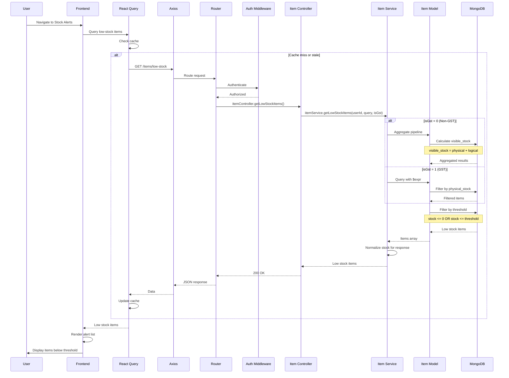
```mermaid
sequenceDiagram
    participant U as User
    participant F as Frontend
    participant RQ as React Query
    participant A as Axios
    participant R as Router
    participant AM as Auth Middleware
    participant IC as Item Controller
    participant IS as Item Service
    participant IM as Item Model
    participant DB as MongoDB

    U->>F: Navigate to Stock Alerts
    F->>RQ: Query low-stock items
    RQ->>RQ: Check cache
    
    alt Cache miss or stale
        RQ->>A: GET /items/low-stock
        A->>R: Route request
        R->>AM: Authenticate
        AM-->>R: Authorized
        R->>IC: itemController.getLowStockItems()
        IC->>IS: itemService.getLowStockItems(userId, query, isGst)
        
        alt isGst = 0 (Non-GST)
            IS->>IM: Aggregate pipeline
            IM->>DB: Calculate visible_stock
            Note over IM,DB: visible_stock = physical + logical
            DB-->>IM: Aggregated results
        else isGst = 1 (GST)
            IS->>IM: Query with $expr
            IM->>DB: Filter by physical_stock
            DB-->>IM: Filtered items
        end
        
        IM->>DB: Filter by threshold
        Note over IM,DB: stock <= 0 OR stock <= threshold
        DB-->>IM: Low stock items
        IM-->>IS: Items array
        IS->>IS: Normalize stock for response
        IS-->>IC: Low stock items
        IC-->>R: 200 OK
        R-->>A: JSON response
        A-->>RQ: Data
        RQ->>RQ: Update cache
    end
    
    RQ-->>F: Low stock items
    F->>F: Render alert list
    F->>U: Display items below threshold
```

---

## 8. Auto Bill Generation (Cron Job)

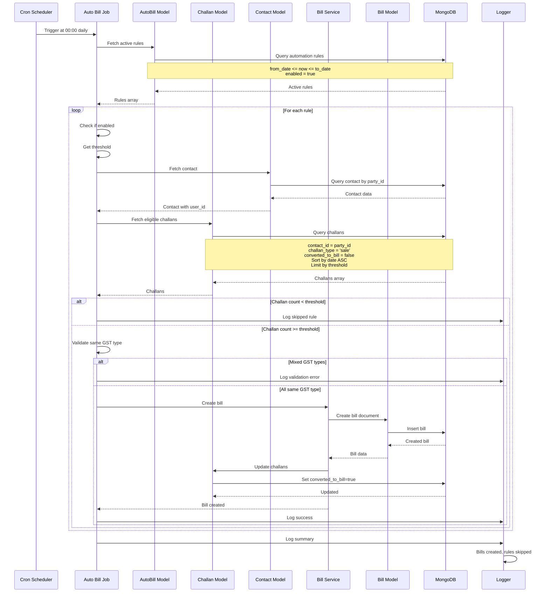
```mermaid
sequenceDiagram
    participant C as Cron Scheduler
    participant J as Auto Bill Job
    participant ABM as AutoBill Model
    participant CM as Challan Model
    participant CTM as Contact Model
    participant BS as Bill Service
    participant BM as Bill Model
    participant DB as MongoDB
    participant L as Logger

    C->>J: Trigger at 00:00 daily
    J->>ABM: Fetch active rules
    ABM->>DB: Query automation rules
    Note over ABM,DB: from_date <= now <= to_date<br/>enabled = true
    DB-->>ABM: Active rules
    ABM-->>J: Rules array
    
    loop For each rule
        J->>J: Check if enabled
        J->>J: Get threshold
        J->>CTM: Fetch contact
        CTM->>DB: Query contact by party_id
        DB-->>CTM: Contact data
        CTM-->>J: Contact with user_id
        
        J->>CM: Fetch eligible challans
        CM->>DB: Query challans
        Note over CM,DB: contact_id = party_id<br/>challan_type = 'sale'<br/>converted_to_bill = false<br/>Sort by date ASC<br/>Limit by threshold
        DB-->>CM: Challans array
        CM-->>J: Challans
        
        alt Challan count < threshold
            J->>L: Log skipped rule
        else Challan count >= threshold
            J->>J: Validate same GST type
            
            alt Mixed GST types
                J->>L: Log validation error
            else All same GST type
                J->>BS: Create bill
                BS->>BM: Create bill document
                BM->>DB: Insert bill
                DB-->>BM: Created bill
                BM-->>BS: Bill data
                BS->>CM: Update challans
                CM->>DB: Set converted_to_bill=true
                DB-->>CM: Updated
                BS-->>J: Bill created
                J->>L: Log success
            end
        end
    end
    
    J->>L: Log summary
    L->>L: Bills created, rules skipped
```

---

## 9. Subscription Expiry Check (Cron Job)

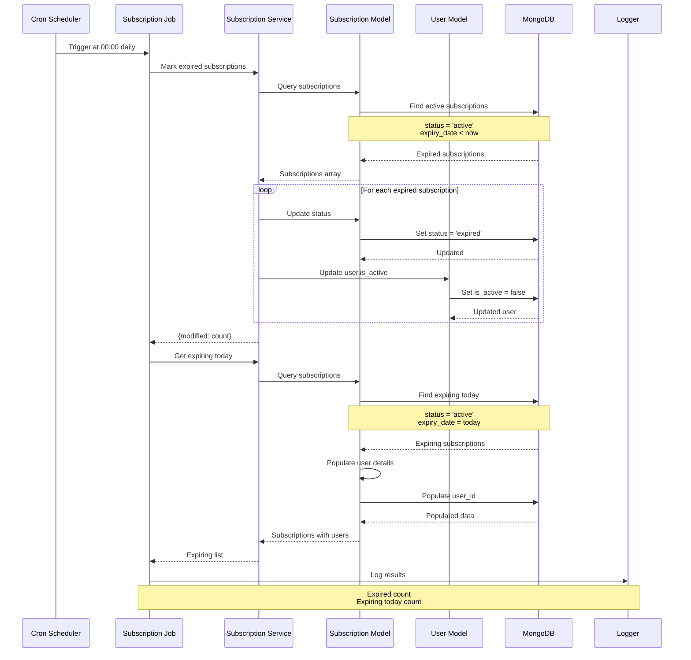
```mermaid
sequenceDiagram
    participant C as Cron Scheduler
    participant J as Subscription Job
    participant SS as Subscription Service
    participant SM as Subscription Model
    participant UM as User Model
    participant DB as MongoDB
    participant L as Logger

    C->>J: Trigger at 00:00 daily
    J->>SS: Mark expired subscriptions
    SS->>SM: Query subscriptions
    SM->>DB: Find active subscriptions
    Note over SM,DB: status = 'active'<br/>expiry_date < now
    DB-->>SM: Expired subscriptions
    SM-->>SS: Subscriptions array
    
    loop For each expired subscription
        SS->>SM: Update status
        SM->>DB: Set status = 'expired'
        DB-->>SM: Updated
        SS->>UM: Update user.is_active
        UM->>DB: Set is_active = false
        DB-->>UM: Updated user
    end
    
    SS-->>J: {modified: count}
    
    J->>SS: Get expiring today
    SS->>SM: Query subscriptions
    SM->>DB: Find expiring today
    Note over SM,DB: status = 'active'<br/>expiry_date = today
    DB-->>SM: Expiring subscriptions
    SM->>SM: Populate user details
    SM->>DB: Populate user_id
    DB-->>SM: Populated data
    SM-->>SS: Subscriptions with users
    SS-->>J: Expiring list
    
    J->>L: Log results
    Note over J,L: Expired count<br/>Expiring today count
```

---

## 10. Report Generation Flow

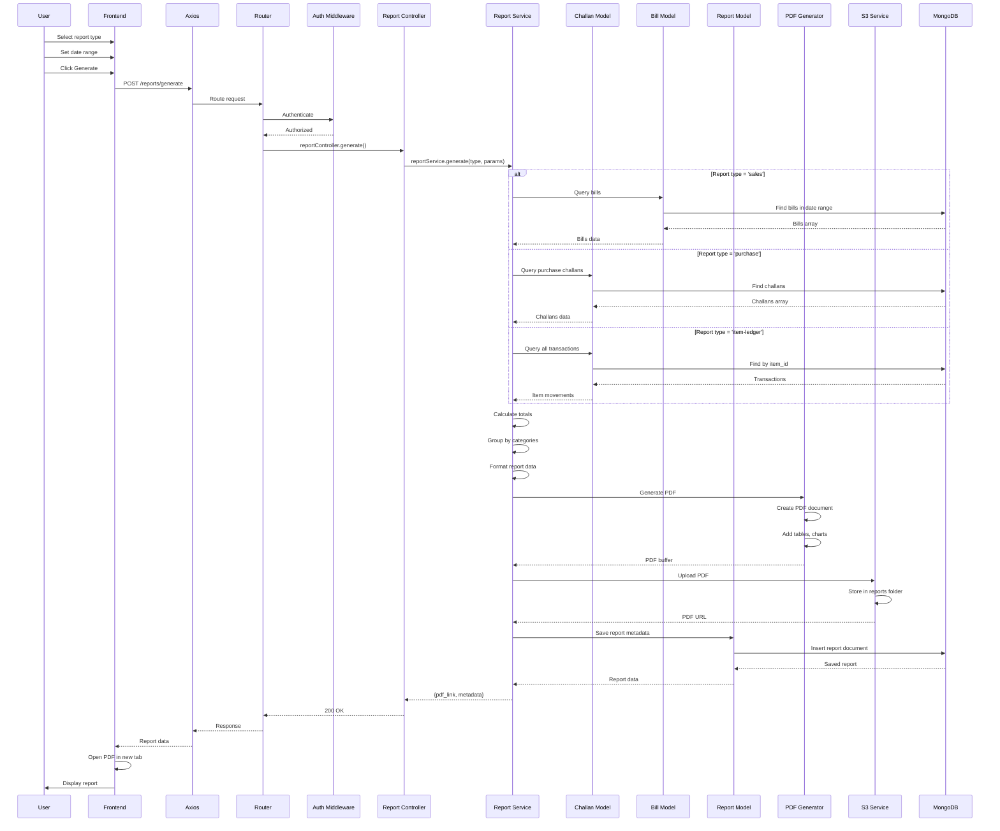
```mermaid
sequenceDiagram
    participant U as User
    participant F as Frontend
    participant A as Axios
    participant R as Router
    participant AM as Auth Middleware
    participant RC as Report Controller
    participant RS as Report Service
    participant CM as Challan Model
    participant BM as Bill Model
    participant RM as Report Model
    participant PDF as PDF Generator
    participant S3 as S3 Service
    participant DB as MongoDB

    U->>F: Select report type
    U->>F: Set date range
    U->>F: Click Generate
    F->>A: POST /reports/generate
    A->>R: Route request
    R->>AM: Authenticate
    AM-->>R: Authorized
    R->>RC: reportController.generate()
    RC->>RS: reportService.generate(type, params)
    
    alt Report type = 'sales'
        RS->>BM: Query bills
        BM->>DB: Find bills in date range
        DB-->>BM: Bills array
        BM-->>RS: Bills data
    else Report type = 'purchase'
        RS->>CM: Query purchase challans
        CM->>DB: Find challans
        DB-->>CM: Challans array
        CM-->>RS: Challans data
    else Report type = 'item-ledger'
        RS->>CM: Query all transactions
        CM->>DB: Find by item_id
        DB-->>CM: Transactions
        CM-->>RS: Item movements
    end
    
    RS->>RS: Calculate totals
    RS->>RS: Group by categories
    RS->>RS: Format report data
    RS->>PDF: Generate PDF
    PDF->>PDF: Create PDF document
    PDF->>PDF: Add tables, charts
    PDF-->>RS: PDF buffer
    RS->>S3: Upload PDF
    S3->>S3: Store in reports folder
    S3-->>RS: PDF URL
    RS->>RM: Save report metadata
    RM->>DB: Insert report document
    DB-->>RM: Saved report
    RM-->>RS: Report data
    RS-->>RC: {pdf_link, metadata}
    RC-->>R: 200 OK
    R-->>A: Response
    A-->>F: Report data
    F->>F: Open PDF in new tab
    F->>U: Display report
```

---

## 11. Batch Item Update Flow

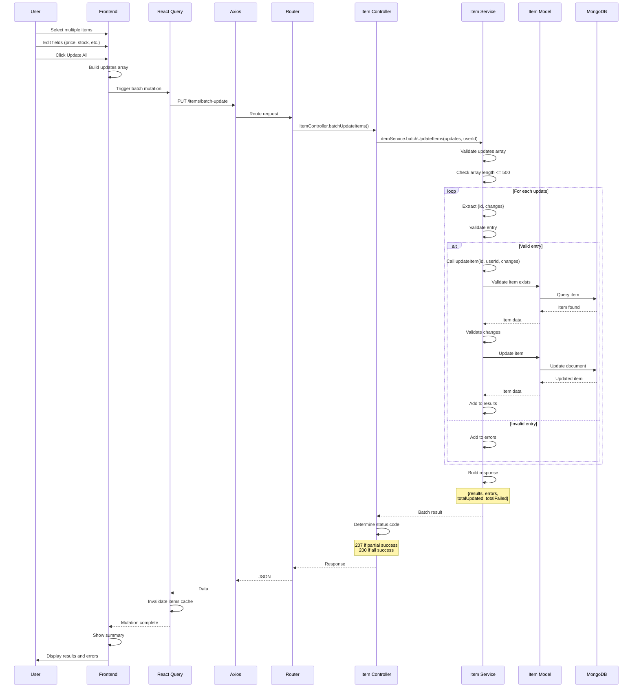
```mermaid
sequenceDiagram
    participant U as User
    participant F as Frontend
    participant RQ as React Query
    participant A as Axios
    participant R as Router
    participant IC as Item Controller
    participant IS as Item Service
    participant IM as Item Model
    participant DB as MongoDB

    U->>F: Select multiple items
    U->>F: Edit fields (price, stock, etc.)
    U->>F: Click Update All
    F->>F: Build updates array
    F->>RQ: Trigger batch mutation
    RQ->>A: PUT /items/batch-update
    A->>R: Route request
    R->>IC: itemController.batchUpdateItems()
    IC->>IS: itemService.batchUpdateItems(updates, userId)
    IS->>IS: Validate updates array
    IS->>IS: Check array length <= 500
    
    loop For each update
        IS->>IS: Extract {id, changes}
        IS->>IS: Validate entry
        
        alt Valid entry
            IS->>IS: Call updateItem(id, userId, changes)
            IS->>IM: Validate item exists
            IM->>DB: Query item
            DB-->>IM: Item found
            IM-->>IS: Item data
            IS->>IS: Validate changes
            IS->>IM: Update item
            IM->>DB: Update document
            DB-->>IM: Updated item
            IM-->>IS: Item data
            IS->>IS: Add to results
        else Invalid entry
            IS->>IS: Add to errors
        end
    end
    
    IS->>IS: Build response
    Note over IS: {results, errors,<br/>totalUpdated, totalFailed}
    IS-->>IC: Batch result
    IC->>IC: Determine status code
    Note over IC: 207 if partial success<br/>200 if all success
    IC-->>R: Response
    R-->>A: JSON
    A-->>RQ: Data
    RQ->>RQ: Invalidate items cache
    RQ-->>F: Mutation complete
    F->>F: Show summary
    F->>U: Display results and errors
```

---

## 12. Outstanding Report Flow

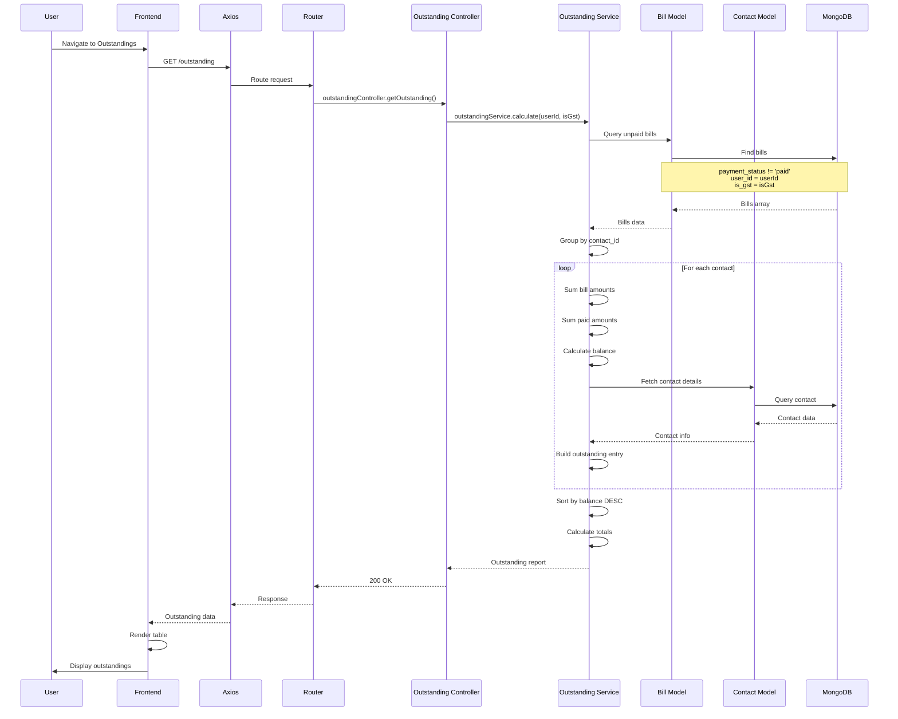
```mermaid
sequenceDiagram
    participant U as User
    participant F as Frontend
    participant A as Axios
    participant R as Router
    participant OC as Outstanding Controller
    participant OS as Outstanding Service
    participant BM as Bill Model
    participant CM as Contact Model
    participant DB as MongoDB

    U->>F: Navigate to Outstandings
    F->>A: GET /outstanding
    A->>R: Route request
    R->>OC: outstandingController.getOutstanding()
    OC->>OS: outstandingService.calculate(userId, isGst)
    OS->>BM: Query unpaid bills
    BM->>DB: Find bills
    Note over BM,DB: payment_status != 'paid'<br/>user_id = userId<br/>is_gst = isGst
    DB-->>BM: Bills array
    BM-->>OS: Bills data
    
    OS->>OS: Group by contact_id
    
    loop For each contact
        OS->>OS: Sum bill amounts
        OS->>OS: Sum paid amounts
        OS->>OS: Calculate balance
        OS->>CM: Fetch contact details
        CM->>DB: Query contact
        DB-->>CM: Contact data
        CM-->>OS: Contact info
        OS->>OS: Build outstanding entry
    end
    
    OS->>OS: Sort by balance DESC
    OS->>OS: Calculate totals
    OS-->>OC: Outstanding report
    OC-->>R: 200 OK
    R-->>A: Response
    A-->>F: Outstanding data
    F->>F: Render table
    F->>U: Display outstandings
```

---

## 13. Session Management Flow

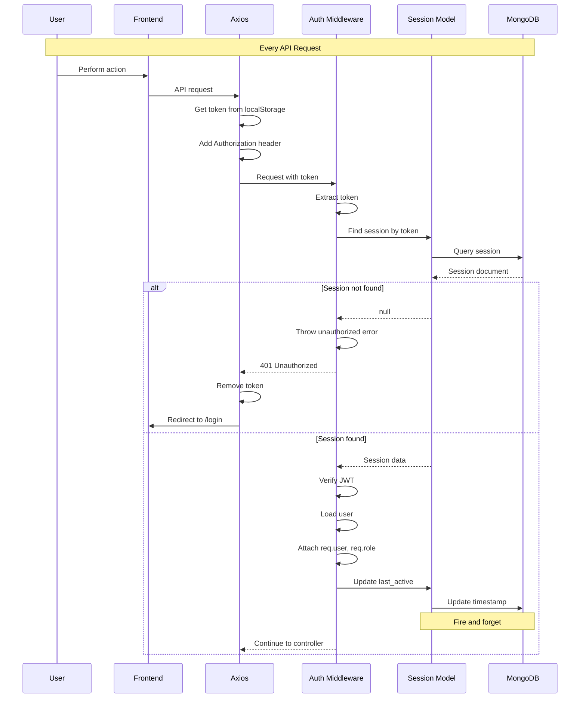
```mermaid
sequenceDiagram
    participant U as User
    participant F as Frontend
    participant A as Axios
    participant AM as Auth Middleware
    participant SM as Session Model
    participant DB as MongoDB

    Note over U,DB: Every API Request
    
    U->>F: Perform action
    F->>A: API request
    A->>A: Get token from localStorage
    A->>A: Add Authorization header
    A->>AM: Request with token
    AM->>AM: Extract token
    AM->>SM: Find session by token
    SM->>DB: Query session
    DB-->>SM: Session document
    
    alt Session not found
        SM-->>AM: null
        AM->>AM: Throw unauthorized error
        AM-->>A: 401 Unauthorized
        A->>A: Remove token
        A->>F: Redirect to /login
    else Session found
        SM-->>AM: Session data
        AM->>AM: Verify JWT
        AM->>AM: Load user
        AM->>AM: Attach req.user, req.role
        AM->>SM: Update last_active
        SM->>DB: Update timestamp
        Note over SM,DB: Fire and forget
        AM-->>A: Continue to controller
    end
```

---

## 14. Logout Flow

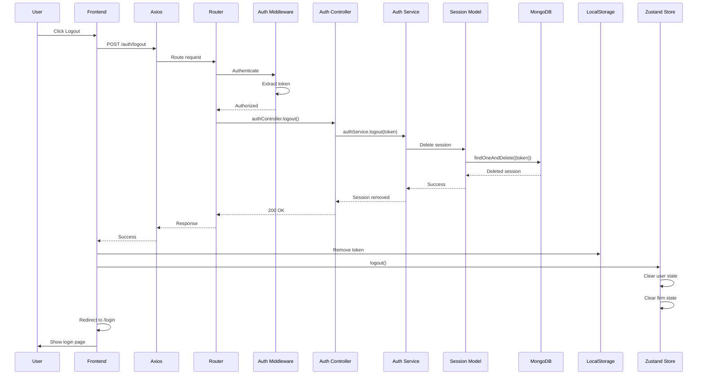
```mermaid
sequenceDiagram
    participant U as User
    participant F as Frontend
    participant A as Axios
    participant R as Router
    participant AM as Auth Middleware
    participant AC as Auth Controller
    participant AS as Auth Service
    participant SM as Session Model
    participant DB as MongoDB
    participant LS as LocalStorage
    participant Z as Zustand Store

    U->>F: Click Logout
    F->>A: POST /auth/logout
    A->>R: Route request
    R->>AM: Authenticate
    AM->>AM: Extract token
    AM-->>R: Authorized
    R->>AC: authController.logout()
    AC->>AS: authService.logout(token)
    AS->>SM: Delete session
    SM->>DB: findOneAndDelete({token})
    DB-->>SM: Deleted session
    SM-->>AS: Success
    AS-->>AC: Session removed
    AC-->>R: 200 OK
    R-->>A: Response
    A-->>F: Success
    F->>LS: Remove token
    F->>Z: logout()
    Z->>Z: Clear user state
    Z->>Z: Clear firm state
    F->>F: Redirect to /login
    F->>U: Show login page
```

---

## 15. Firm Switching Flow

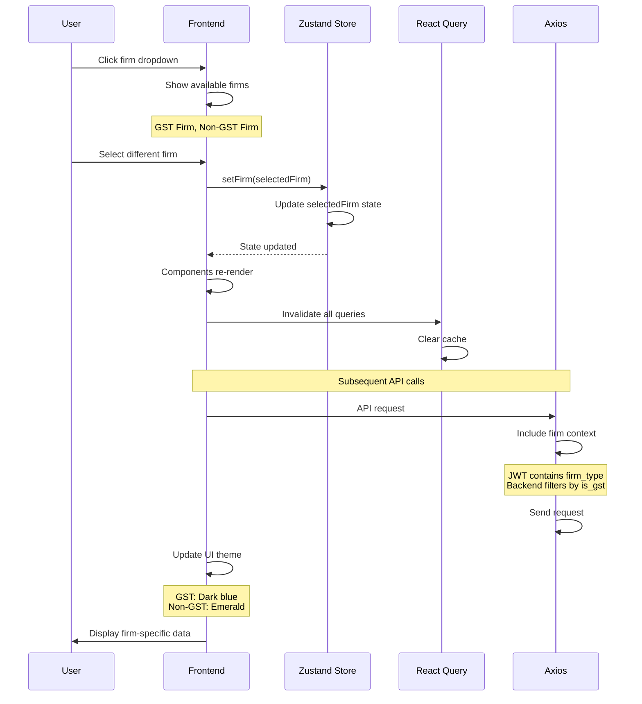
```mermaid
sequenceDiagram
    participant U as User
    participant F as Frontend
    participant Z as Zustand Store
    participant RQ as React Query
    participant A as Axios

    U->>F: Click firm dropdown
    F->>F: Show available firms
    Note over F: GST Firm, Non-GST Firm
    U->>F: Select different firm
    F->>Z: setFirm(selectedFirm)
    Z->>Z: Update selectedFirm state
    Z-->>F: State updated
    F->>F: Components re-render
    F->>RQ: Invalidate all queries
    RQ->>RQ: Clear cache
    
    Note over F,A: Subsequent API calls
    
    F->>A: API request
    A->>A: Include firm context
    Note over A: JWT contains firm_type<br/>Backend filters by is_gst
    A->>A: Send request
    
    F->>F: Update UI theme
    Note over F: GST: Dark blue<br/>Non-GST: Emerald
    F->>U: Display firm-specific data
```

---

## Summary

These sequence diagrams illustrate:

✅ **Authentication flows** - Admin and firm login with JWT
✅ **Core business flows** - Item creation, challan, bill generation
✅ **Payment processing** - Payment recording and balance updates
✅ **Stock management** - Real-time stock updates and alerts
✅ **Automation** - Cron jobs for auto-billing and subscription checks
✅ **Reporting** - Report generation with PDF export
✅ **Session management** - Token validation and session tracking
✅ **Multi-tenancy** - User-based data isolation
✅ **Firm context** - GST/Non-GST switching

All flows demonstrate the complete request-response cycle from user action to database operation and back to the UI.
